# Admin Module — Diagrams (Mermaid)

> Starting from section **3.43** as requested.  
> Format: `3.4x <Feature>` → `3.4x.1 Class Diagram` → `3.4x.2 Sequence Diagram`

---

## 3.43 View Account List

### 3.43.1 Class Diagram

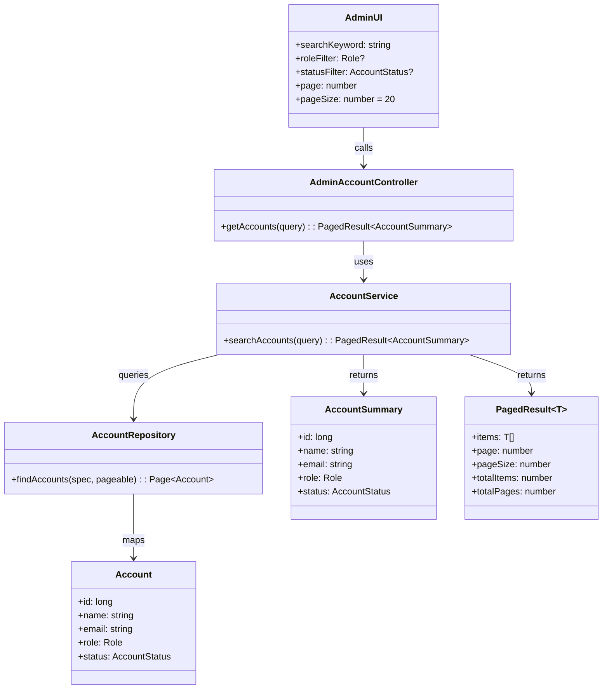
```mermaid
classDiagram
direction TB

class AdminUI {
  +searchKeyword: string
  +roleFilter: Role?
  +statusFilter: AccountStatus?
  +page: number
  +pageSize: number = 20
}

class AdminAccountController {
  +getAccounts(query): PagedResult~AccountSummary~
}

class AccountService {
  +searchAccounts(query): PagedResult~AccountSummary~
}

class AccountRepository {
  +findAccounts(spec, pageable): Page~Account~
}

class Account {
  +id: long
  +name: string
  +email: string
  +role: Role
  +status: AccountStatus
}

class AccountSummary {
  +id: long
  +name: string
  +email: string
  +role: Role
  +status: AccountStatus
}

class PagedResult~T~ {
  +items: T[]
  +page: number
  +pageSize: number
  +totalItems: number
  +totalPages: number
}

AdminUI --> AdminAccountController : calls
AdminAccountController --> AccountService : uses
AccountService --> AccountRepository : queries
AccountRepository --> Account : maps
AccountService --> AccountSummary : returns
AccountService --> PagedResult~AccountSummary~ : returns
```

### 3.43.2 Sequence Diagram

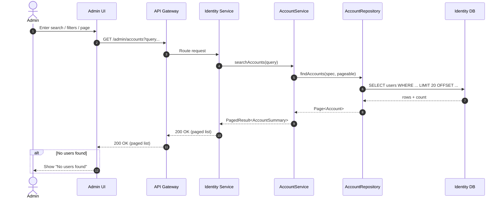
```mermaid
sequenceDiagram
autonumber
actor Admin
participant UI as Admin UI
participant GW as API Gateway
participant Identity as Identity Service
participant Svc as AccountService
participant Repo as AccountRepository
participant DB as Identity DB

Admin->>UI: Enter search / filters / page
UI->>GW: GET /admin/accounts?query...
GW->>Identity: Route request
Identity->>Svc: searchAccounts(query)
Svc->>Repo: findAccounts(spec, pageable)
Repo->>DB: SELECT users WHERE ... LIMIT 20 OFFSET ...
DB-->>Repo: rows + count
Repo-->>Svc: Page<Account>
Svc-->>Identity: PagedResult<AccountSummary>
Identity-->>GW: 200 OK (paged list)
GW-->>UI: 200 OK (paged list)
alt No users found
UI-->>Admin: Show "No users found"
end
```

---

## 3.44 Disable Account

### 3.44.1 Class Diagram

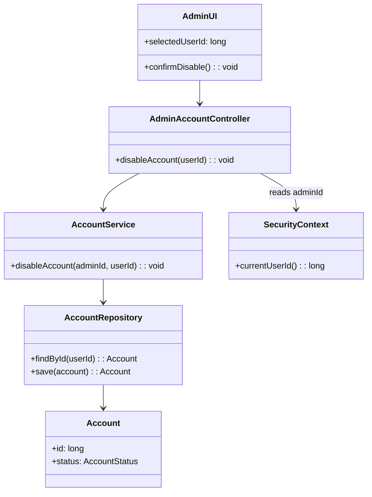
```mermaid
classDiagram
direction TB

class AdminUI {
  +selectedUserId: long
  +confirmDisable(): void
}

class AdminAccountController {
  +disableAccount(userId): void
}

class AccountService {
  +disableAccount(adminId, userId): void
}

class AccountRepository {
  +findById(userId): Account
  +save(account): Account
}

class Account {
  +id: long
  +status: AccountStatus
}

class SecurityContext {
  +currentUserId(): long
}

AdminUI --> AdminAccountController
AdminAccountController --> SecurityContext : reads adminId
AdminAccountController --> AccountService
AccountService --> AccountRepository
AccountRepository --> Account
```

### 3.44.2 Sequence Diagram

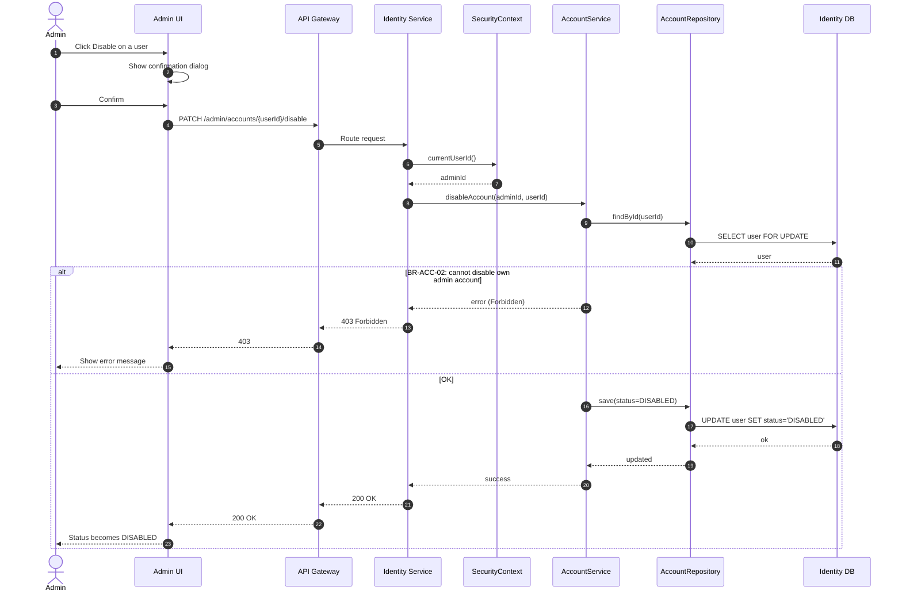
```mermaid
sequenceDiagram
autonumber
actor Admin
participant UI as Admin UI
participant GW as API Gateway
participant Identity as Identity Service
participant Sec as SecurityContext
participant Svc as AccountService
participant Repo as AccountRepository
participant DB as Identity DB

Admin->>UI: Click Disable on a user
UI->>UI: Show confirmation dialog
Admin->>UI: Confirm
UI->>GW: PATCH /admin/accounts/{userId}/disable
GW->>Identity: Route request
Identity->>Sec: currentUserId()
Sec-->>Identity: adminId
Identity->>Svc: disableAccount(adminId, userId)
Svc->>Repo: findById(userId)
Repo->>DB: SELECT user FOR UPDATE
DB-->>Repo: user
alt BR-ACC-02: cannot disable own admin account
Svc-->>Identity: error (Forbidden)
Identity-->>GW: 403 Forbidden
GW-->>UI: 403
UI-->>Admin: Show error message
else OK
Svc->>Repo: save(status=DISABLED)
Repo->>DB: UPDATE user SET status='DISABLED'
DB-->>Repo: ok
Repo-->>Svc: updated
Svc-->>Identity: success
Identity-->>GW: 200 OK
GW-->>UI: 200 OK
UI-->>Admin: Status becomes DISABLED
end
```

---

## 3.45 Activate Account

### 3.45.1 Class Diagram

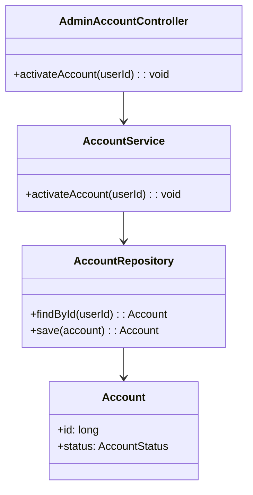
```mermaid
classDiagram
direction TB

class AdminAccountController {
  +activateAccount(userId): void
}

class AccountService {
  +activateAccount(userId): void
}

class AccountRepository {
  +findById(userId): Account
  +save(account): Account
}

class Account {
  +id: long
  +status: AccountStatus
}

AdminAccountController --> AccountService
AccountService --> AccountRepository
AccountRepository --> Account
```

### 3.45.2 Sequence Diagram

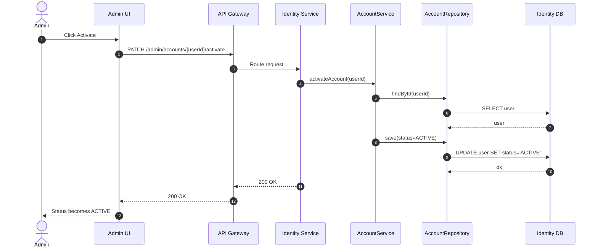
```mermaid
sequenceDiagram
autonumber
actor Admin
participant UI as Admin UI
participant GW as API Gateway
participant Identity as Identity Service
participant Svc as AccountService
participant Repo as AccountRepository
participant DB as Identity DB

Admin->>UI: Click Activate
UI->>GW: PATCH /admin/accounts/{userId}/activate
GW->>Identity: Route request
Identity->>Svc: activateAccount(userId)
Svc->>Repo: findById(userId)
Repo->>DB: SELECT user
DB-->>Repo: user
Svc->>Repo: save(status=ACTIVE)
Repo->>DB: UPDATE user SET status='ACTIVE'
DB-->>Repo: ok
Identity-->>GW: 200 OK
GW-->>UI: 200 OK
UI-->>Admin: Status becomes ACTIVE
```

---

## 3.46 View Account Details

### 3.46.1 Class Diagram

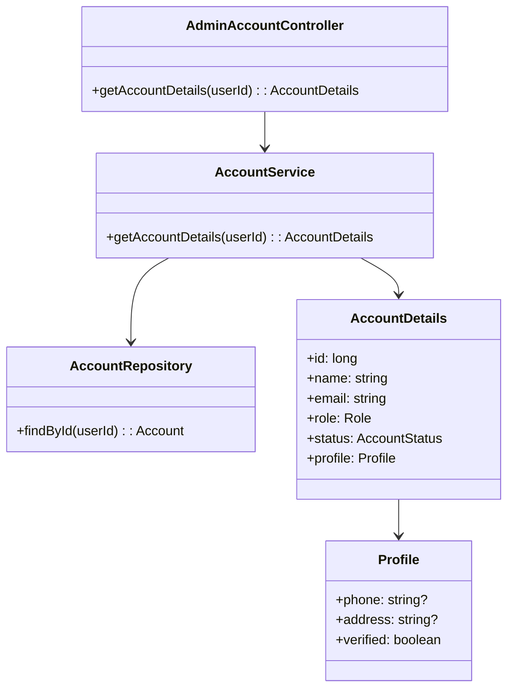
```mermaid
classDiagram
direction TB

class AdminAccountController {
  +getAccountDetails(userId): AccountDetails
}

class AccountService {
  +getAccountDetails(userId): AccountDetails
}

class AccountRepository {
  +findById(userId): Account
}

class AccountDetails {
  +id: long
  +name: string
  +email: string
  +role: Role
  +status: AccountStatus
  +profile: Profile
}

class Profile {
  +phone: string?
  +address: string?
  +verified: boolean
}

AdminAccountController --> AccountService
AccountService --> AccountRepository
AccountService --> AccountDetails
AccountDetails --> Profile
```

### 3.46.2 Sequence Diagram

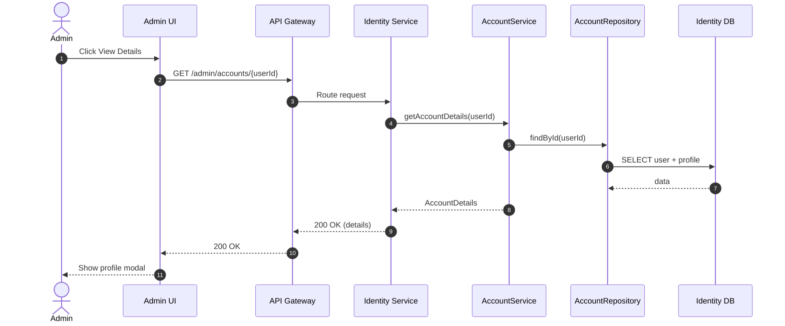
```mermaid
sequenceDiagram
autonumber
actor Admin
participant UI as Admin UI
participant GW as API Gateway
participant Identity as Identity Service
participant Svc as AccountService
participant Repo as AccountRepository
participant DB as Identity DB

Admin->>UI: Click View Details
UI->>GW: GET /admin/accounts/{userId}
GW->>Identity: Route request
Identity->>Svc: getAccountDetails(userId)
Svc->>Repo: findById(userId)
Repo->>DB: SELECT user + profile
DB-->>Repo: data
Svc-->>Identity: AccountDetails
Identity-->>GW: 200 OK (details)
GW-->>UI: 200 OK
UI-->>Admin: Show profile modal
```

---

## 3.47 Create Campaign Category

### 3.47.1 Class Diagram

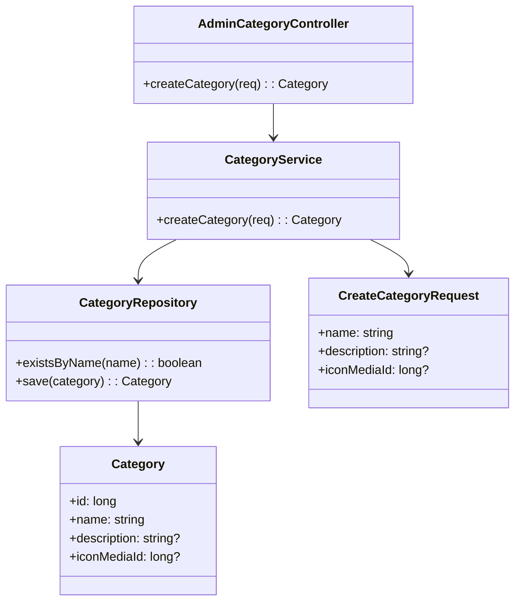
```mermaid
classDiagram
direction TB

class AdminCategoryController {
  +createCategory(req): Category
}

class CategoryService {
  +createCategory(req): Category
}

class CategoryRepository {
  +existsByName(name): boolean
  +save(category): Category
}

class Category {
  +id: long
  +name: string
  +description: string?
  +iconMediaId: long?
}

class CreateCategoryRequest {
  +name: string
  +description: string?
  +iconMediaId: long?
}

AdminCategoryController --> CategoryService
CategoryService --> CategoryRepository
CategoryService --> CreateCategoryRequest
CategoryRepository --> Category
```

### 3.47.2 Sequence Diagram

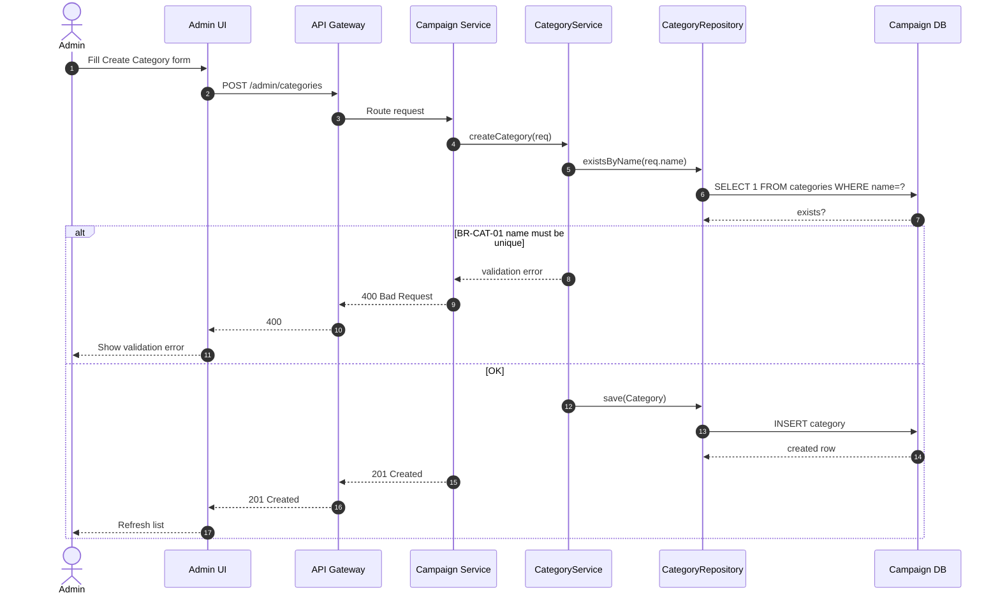
```mermaid
sequenceDiagram
autonumber
actor Admin
participant UI as Admin UI
participant GW as API Gateway
participant Campaign as Campaign Service
participant Svc as CategoryService
participant Repo as CategoryRepository
participant DB as Campaign DB

Admin->>UI: Fill Create Category form
UI->>GW: POST /admin/categories
GW->>Campaign: Route request
Campaign->>Svc: createCategory(req)
Svc->>Repo: existsByName(req.name)
Repo->>DB: SELECT 1 FROM categories WHERE name=?
DB-->>Repo: exists?
alt BR-CAT-01 name must be unique
Svc-->>Campaign: validation error
Campaign-->>GW: 400 Bad Request
GW-->>UI: 400
UI-->>Admin: Show validation error
else OK
Svc->>Repo: save(Category)
Repo->>DB: INSERT category
DB-->>Repo: created row
Campaign-->>GW: 201 Created
GW-->>UI: 201 Created
UI-->>Admin: Refresh list
end
```

---

## 3.48 Edit Campaign Category

### 3.48.1 Class Diagram

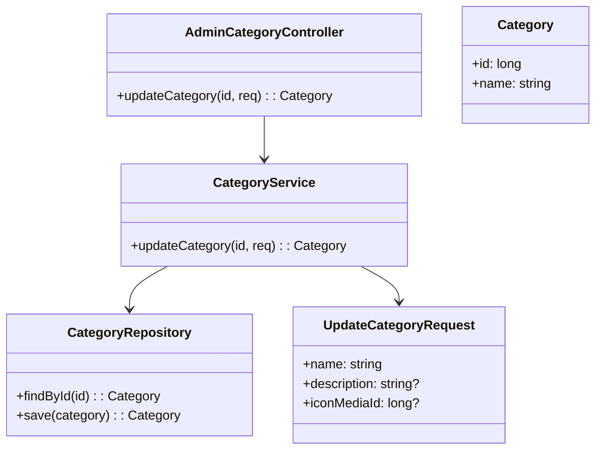
```mermaid
classDiagram
direction TB

class AdminCategoryController {
  +updateCategory(id, req): Category
}
class CategoryService {
  +updateCategory(id, req): Category
}
class CategoryRepository {
  +findById(id): Category
  +save(category): Category
}
class UpdateCategoryRequest {
  +name: string
  +description: string?
  +iconMediaId: long?
}
class Category {
  +id: long
  +name: string
}

AdminCategoryController --> CategoryService
CategoryService --> CategoryRepository
CategoryService --> UpdateCategoryRequest
```

### 3.48.2 Sequence Diagram

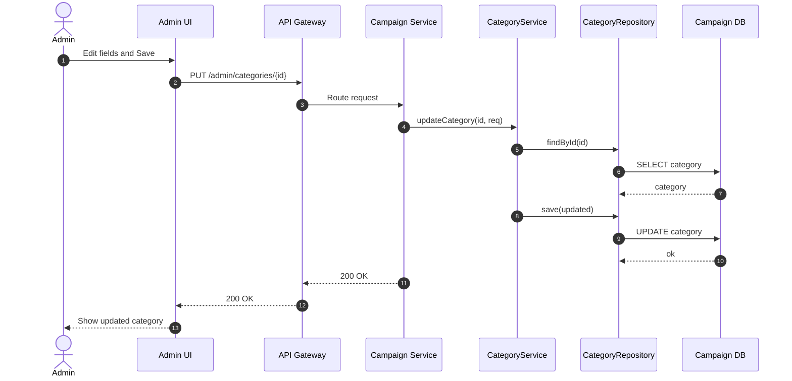
```mermaid
sequenceDiagram
autonumber
actor Admin
participant UI as Admin UI
participant GW as API Gateway
participant Campaign as Campaign Service
participant Svc as CategoryService
participant Repo as CategoryRepository
participant DB as Campaign DB

Admin->>UI: Edit fields and Save
UI->>GW: PUT /admin/categories/{id}
GW->>Campaign: Route request
Campaign->>Svc: updateCategory(id, req)
Svc->>Repo: findById(id)
Repo->>DB: SELECT category
DB-->>Repo: category
Svc->>Repo: save(updated)
Repo->>DB: UPDATE category
DB-->>Repo: ok
Campaign-->>GW: 200 OK
GW-->>UI: 200 OK
UI-->>Admin: Show updated category
```

---

## 3.49 View Campaign Category List

### 3.49.1 Class Diagram

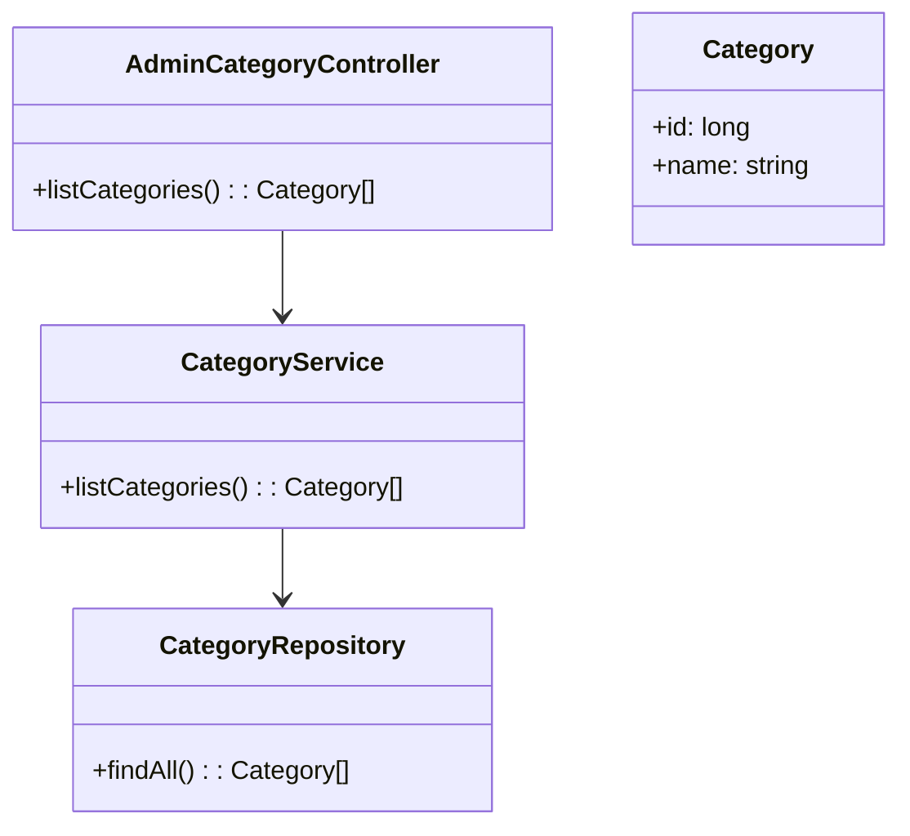
```mermaid
classDiagram
direction TB

class AdminCategoryController {
  +listCategories(): Category[]
}
class CategoryService {
  +listCategories(): Category[]
}
class CategoryRepository {
  +findAll(): Category[]
}
class Category {
  +id: long
  +name: string
}

AdminCategoryController --> CategoryService
CategoryService --> CategoryRepository
```

### 3.49.2 Sequence Diagram

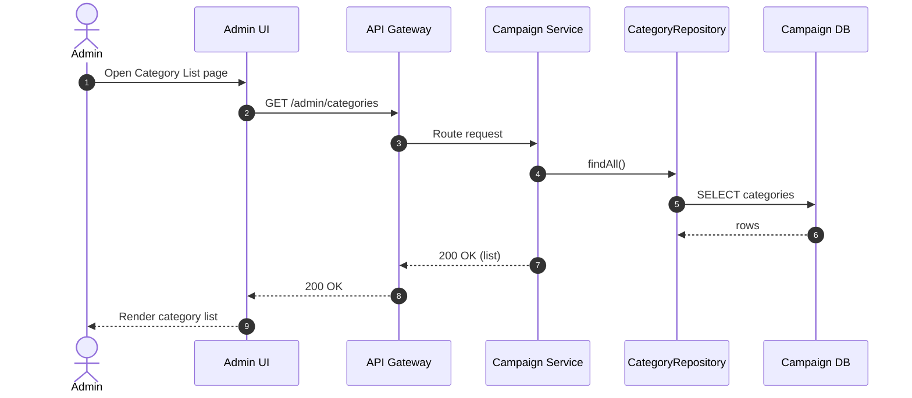
```mermaid
sequenceDiagram
autonumber
actor Admin
participant UI as Admin UI
participant GW as API Gateway
participant Campaign as Campaign Service
participant Repo as CategoryRepository
participant DB as Campaign DB

Admin->>UI: Open Category List page
UI->>GW: GET /admin/categories
GW->>Campaign: Route request
Campaign->>Repo: findAll()
Repo->>DB: SELECT categories
DB-->>Repo: rows
Campaign-->>GW: 200 OK (list)
GW-->>UI: 200 OK
UI-->>Admin: Render category list
```

---

## 3.50 Suspend Fund Owner

### 3.50.1 Class Diagram

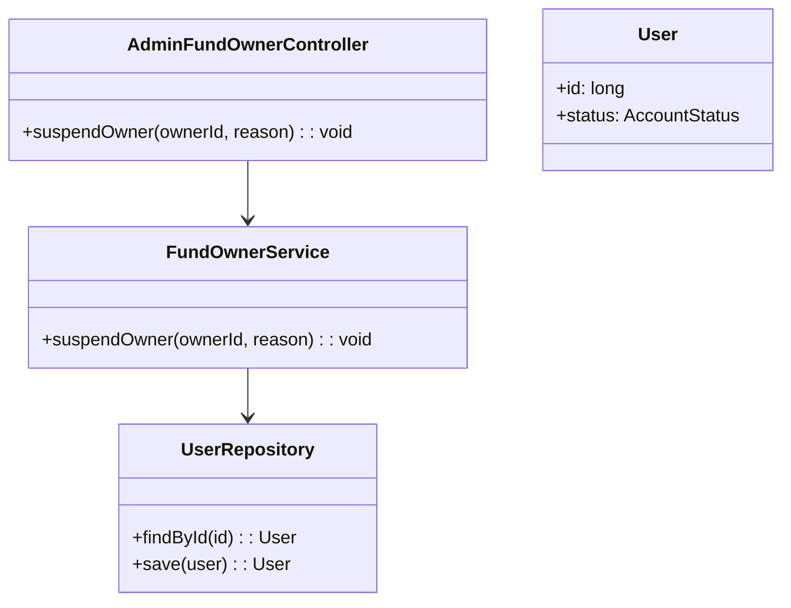
```mermaid
classDiagram
direction TB

class AdminFundOwnerController {
  +suspendOwner(ownerId, reason): void
}
class FundOwnerService {
  +suspendOwner(ownerId, reason): void
}
class UserRepository {
  +findById(id): User
  +save(user): User
}
class User {
  +id: long
  +status: AccountStatus
}

AdminFundOwnerController --> FundOwnerService
FundOwnerService --> UserRepository
```

### 3.50.2 Sequence Diagram

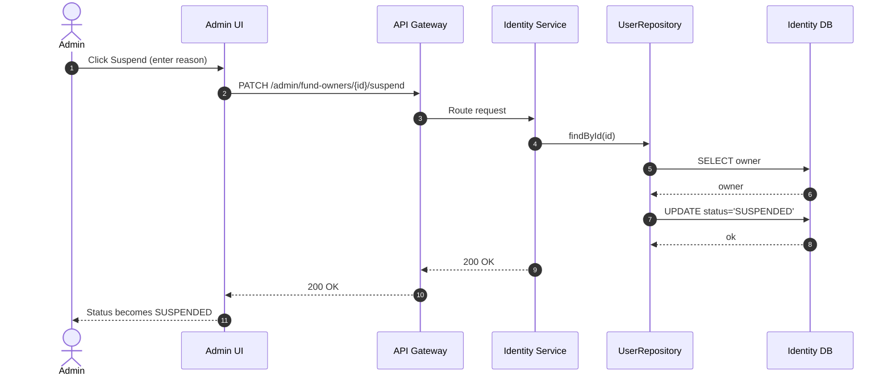
```mermaid
sequenceDiagram
autonumber
actor Admin
participant UI as Admin UI
participant GW as API Gateway
participant Identity as Identity Service
participant Repo as UserRepository
participant DB as Identity DB

Admin->>UI: Click Suspend (enter reason)
UI->>GW: PATCH /admin/fund-owners/{id}/suspend
GW->>Identity: Route request
Identity->>Repo: findById(id)
Repo->>DB: SELECT owner
DB-->>Repo: owner
Repo->>DB: UPDATE status='SUSPENDED'
DB-->>Repo: ok
Identity-->>GW: 200 OK
GW-->>UI: 200 OK
UI-->>Admin: Status becomes SUSPENDED
```

---

## 3.51 Reinstate Fund Owner

### 3.51.1 Class Diagram

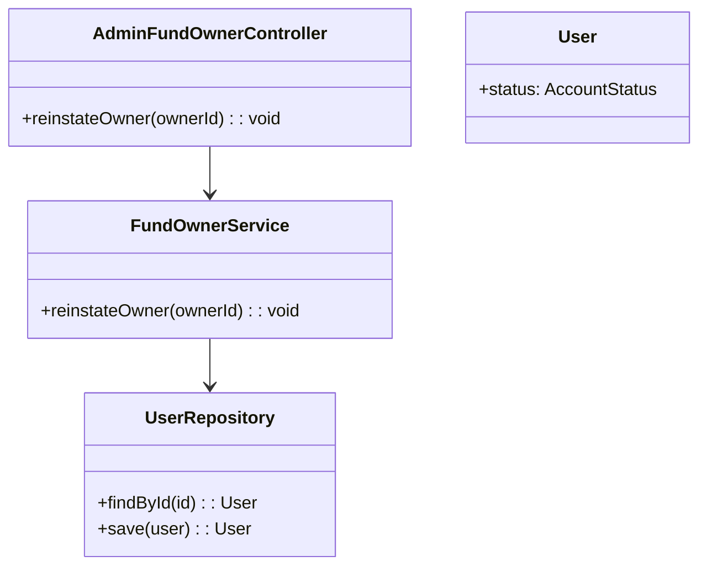
```mermaid
classDiagram
direction TB

class AdminFundOwnerController {
  +reinstateOwner(ownerId): void
}
class FundOwnerService {
  +reinstateOwner(ownerId): void
}
class UserRepository {
  +findById(id): User
  +save(user): User
}
class User {
  +status: AccountStatus
}

AdminFundOwnerController --> FundOwnerService
FundOwnerService --> UserRepository
```

### 3.51.2 Sequence Diagram

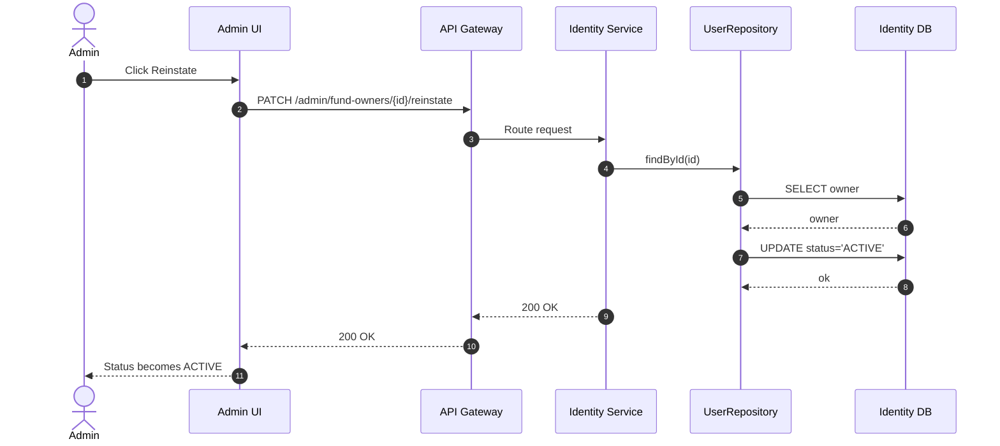
```mermaid
sequenceDiagram
autonumber
actor Admin
participant UI as Admin UI
participant GW as API Gateway
participant Identity as Identity Service
participant Repo as UserRepository
participant DB as Identity DB

Admin->>UI: Click Reinstate
UI->>GW: PATCH /admin/fund-owners/{id}/reinstate
GW->>Identity: Route request
Identity->>Repo: findById(id)
Repo->>DB: SELECT owner
DB-->>Repo: owner
Repo->>DB: UPDATE status='ACTIVE'
DB-->>Repo: ok
Identity-->>GW: 200 OK
GW-->>UI: 200 OK
UI-->>Admin: Status becomes ACTIVE
```

---

## 3.52 View Fund Owner List

### 3.52.1 Class Diagram

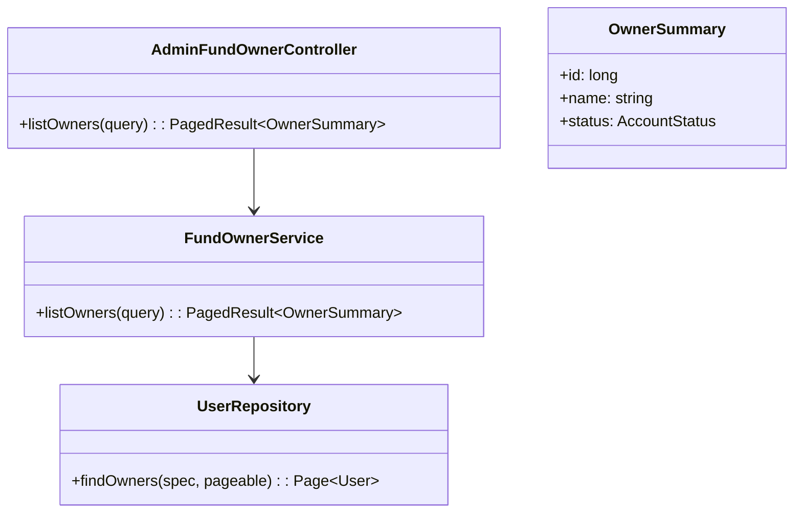
```mermaid
classDiagram
direction TB

class AdminFundOwnerController {
  +listOwners(query): PagedResult~OwnerSummary~
}
class FundOwnerService {
  +listOwners(query): PagedResult~OwnerSummary~
}
class UserRepository {
  +findOwners(spec, pageable): Page~User~
}
class OwnerSummary {
  +id: long
  +name: string
  +status: AccountStatus
}

AdminFundOwnerController --> FundOwnerService
FundOwnerService --> UserRepository
```

### 3.52.2 Sequence Diagram

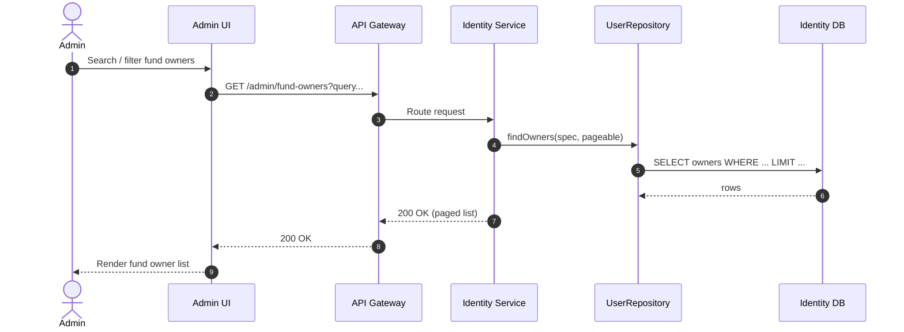
```mermaid
sequenceDiagram
autonumber
actor Admin
participant UI as Admin UI
participant GW as API Gateway
participant Identity as Identity Service
participant Repo as UserRepository
participant DB as Identity DB

Admin->>UI: Search / filter fund owners
UI->>GW: GET /admin/fund-owners?query...
GW->>Identity: Route request
Identity->>Repo: findOwners(spec, pageable)
Repo->>DB: SELECT owners WHERE ... LIMIT ...
DB-->>Repo: rows
Identity-->>GW: 200 OK (paged list)
GW-->>UI: 200 OK
UI-->>Admin: Render fund owner list
```

---

## 3.53 View Donation Logs

### 3.53.1 Class Diagram

```mermaid
classDiagram
direction TB

class AdminCashFlowController {
  +getDonationLogs(filter): PagedResult~DonationLog~
}
class DonationService {
  +getDonationLogs(filter): PagedResult~DonationLog~
}
class DonationRepository {
  +findDonations(filter, pageable): Page~Donation~
}
class DonationLog {
  +id: long
  +campaignId: long
  +amount: decimal
  +status: string
  +createdAt: datetime
}

AdminCashFlowController --> DonationService
DonationService --> DonationRepository
```

### 3.53.2 Sequence Diagram

```mermaid
sequenceDiagram
autonumber
actor Admin
participant UI as Admin UI
participant GW as API Gateway
participant Payment as Payment Service
participant Repo as DonationRepository
participant DB as Payment DB

Admin->>UI: Filter by date/campaign/status
UI->>GW: GET /admin/cashflow/donations?filter...
GW->>Payment: Route request
Payment->>Repo: findDonations(filter, pageable)
Repo->>DB: SELECT donations WHERE ...
DB-->>Repo: rows
Payment-->>GW: 200 OK (paged list)
GW-->>UI: 200 OK
UI-->>Admin: Render donation logs
```

---

## 3.54 View Withdrawal Logs

### 3.54.1 Class Diagram

```mermaid
classDiagram
direction TB

class AdminCashFlowController {
  +getWithdrawalLogs(filter): PagedResult~WithdrawalLog~
}
class WithdrawalService {
  +getWithdrawalLogs(filter): PagedResult~WithdrawalLog~
}
class WithdrawalRepository {
  +findWithdrawals(filter, pageable): Page~Withdrawal~
}
class WithdrawalLog {
  +id: long
  +campaignId: long
  +amount: decimal
  +status: string
  +createdAt: datetime
}

AdminCashFlowController --> WithdrawalService
WithdrawalService --> WithdrawalRepository
```

### 3.54.2 Sequence Diagram

```mermaid
sequenceDiagram
autonumber
actor Admin
participant UI as Admin UI
participant GW as API Gateway
participant Payment as Payment Service
participant Repo as WithdrawalRepository
participant DB as Payment DB

Admin->>UI: Filter by status/date
UI->>GW: GET /admin/cashflow/withdrawals?filter...
GW->>Payment: Route request
Payment->>Repo: findWithdrawals(filter, pageable)
Repo->>DB: SELECT withdrawals WHERE ...
DB-->>Repo: rows
Payment-->>GW: 200 OK (paged list)
GW-->>UI: 200 OK
UI-->>Admin: Render withdrawal logs
```

---

## 3.55 View Fund Usage Logs

### 3.55.1 Class Diagram

```mermaid
classDiagram
direction TB

class AdminFundUsageController {
  +getFundUsageLogs(filter): PagedResult~ExpenditureLog~
}
class ExpenditureService {
  +getFundUsageLogs(filter): PagedResult~ExpenditureLog~
}
class ExpenditureRepository {
  +findExpenditures(filter, pageable): Page~Expenditure~
}
class ExpenditureLog {
  +id: long
  +campaignId: long
  +amount: decimal
  +status: string
  +submittedAt: datetime
}

AdminFundUsageController --> ExpenditureService
ExpenditureService --> ExpenditureRepository
```

### 3.55.2 Sequence Diagram

```mermaid
sequenceDiagram
autonumber
actor Admin
participant UI as Admin UI
participant GW as API Gateway
participant Campaign as Campaign Service
participant Repo as ExpenditureRepository
participant DB as Campaign DB

Admin->>UI: Filter by status/date
UI->>GW: GET /admin/cashflow/fund-usage?filter...
GW->>Campaign: Route request
Campaign->>Repo: findExpenditures(filter, pageable)
Repo->>DB: SELECT expenditures WHERE ...
DB-->>Repo: rows
Campaign-->>GW: 200 OK (paged list)
GW-->>UI: 200 OK
UI-->>Admin: Render fund usage logs
```

---

## 3.56 Export Audit Data

### 3.56.1 Class Diagram

```mermaid
classDiagram
direction TB

class AdminExportController {
  +exportAuditData(req): FileStream
}
class ExportService {
  +exportAuditData(req): FileStream
}
class AuditQueryService {
  +query(req): AuditDataset
}
class ExcelExporter {
  +toXlsx(dataset): FileStream
}

AdminExportController --> ExportService
ExportService --> AuditQueryService
ExportService --> ExcelExporter
```

### 3.56.2 Sequence Diagram

```mermaid
sequenceDiagram
autonumber
actor Admin
participant UI as Admin UI
participant GW as API Gateway
participant Export as Export Service
participant Query as AuditQueryService
participant Xlsx as ExcelExporter

Admin->>UI: Select date range + type, click Export
UI->>GW: POST /admin/audit/export
GW->>Export: Route request
Export->>Query: query(req)
Query-->>Export: dataset
Export->>Xlsx: toXlsx(dataset)
Xlsx-->>Export: .xlsx stream
Export-->>GW: 200 OK (file download)
GW-->>UI: download TrustFundMe_Report_YYYYMMDD.xlsx
```

---

## 3.57 Configure Donation Rules

### 3.57.1 Class Diagram

```mermaid
classDiagram
direction TB

class AdminConfigController {
  +updateDonationRules(req): Config
}
class ConfigService {
  +updateDonationRules(req): Config
}
class ConfigRepository {
  +save(config): Config
}
class DonationRules {
  +minAmount: decimal
  +maxAmount: decimal
  +feePercent: number
}

AdminConfigController --> ConfigService
ConfigService --> ConfigRepository
ConfigService --> DonationRules
```

### 3.57.2 Sequence Diagram

```mermaid
sequenceDiagram
autonumber
actor Admin
participant UI as Admin UI
participant GW as API Gateway
participant Config as Config Service
participant Repo as ConfigRepository
participant DB as Config DB

Admin->>UI: Update min/max/fee and Save
UI->>GW: PUT /admin/config/donation-rules
GW->>Config: Route request
Config->>Repo: save(rules)
Repo->>DB: UPSERT donation_rules
DB-->>Repo: ok
Config-->>GW: 200 OK
GW-->>UI: 200 OK
UI-->>Admin: Show success
```

---

## 3.58 Configure Withdrawal Limits

### 3.58.1 Class Diagram

```mermaid
classDiagram
direction TB
class WithdrawalLimits {
  +minAmount: decimal
  +maxAmount: decimal
  +fee: decimal
  +processingDays: int
}
class AdminConfigController {
  +updateWithdrawalLimits(req): Config
}
class ConfigService {
  +updateWithdrawalLimits(req): Config
}
AdminConfigController --> ConfigService
ConfigService --> WithdrawalLimits
```

### 3.58.2 Sequence Diagram

```mermaid
sequenceDiagram
autonumber
actor Admin
participant UI as Admin UI
participant GW as API Gateway
participant Config as Config Service

Admin->>UI: Update limits and Save
UI->>GW: PUT /admin/config/withdrawal-limits
GW->>Config: Route request
Config-->>GW: 200 OK
GW-->>UI: 200 OK
UI-->>Admin: Show success
```

---

## 3.59 Configure Evidence Deadline

### 3.59.1 Class Diagram

```mermaid
classDiagram
direction TB
class EvidenceDeadlineConfig {
  +defaultDeadlineDays: int
  +maxExtensionDays: int
  +autoSuspendEnabled: boolean
}
class AdminConfigController {
  +updateEvidenceDeadline(req): Config
}
AdminConfigController --> EvidenceDeadlineConfig
```

### 3.59.2 Sequence Diagram

```mermaid
sequenceDiagram
autonumber
actor Admin
participant UI as Admin UI
participant GW as API Gateway
participant Config as Config Service

Admin->>UI: Update deadline settings and Save
UI->>GW: PUT /admin/config/evidence-deadline
GW->>Config: Route request
Config-->>GW: 200 OK
GW-->>UI: 200 OK
UI-->>Admin: Show success
```

---

## 3.60 Configure Campaign Rules

### 3.60.1 Class Diagram

```mermaid
classDiagram
direction TB
class CampaignRulesConfig {
  +minDurationDays: int
  +maxDurationDays: int
  +minGoal: decimal
  +maxGoal: decimal
  +autoApproveEnabled: boolean
}
class AdminConfigController {
  +updateCampaignRules(req): Config
}
AdminConfigController --> CampaignRulesConfig
```

### 3.60.2 Sequence Diagram

```mermaid
sequenceDiagram
autonumber
actor Admin
participant UI as Admin UI
participant GW as API Gateway
participant Config as Config Service

Admin->>UI: Update campaign rules and Save
UI->>GW: PUT /admin/config/campaign-rules
GW->>Config: Route request
Config-->>GW: 200 OK
GW-->>UI: 200 OK
UI-->>Admin: Show success
```

---

## 3.61 Configure Reporting & Flagging Rules

### 3.61.1 Class Diagram

```mermaid
classDiagram
direction TB
class FlaggingRulesConfig {
  +keywords: string[]
  +threshold: int
  +responseTimeHours: int
}
class AdminConfigController {
  +updateFlaggingRules(req): Config
}
AdminConfigController --> FlaggingRulesConfig
```

### 3.61.2 Sequence Diagram

```mermaid
sequenceDiagram
autonumber
actor Admin
participant UI as Admin UI
participant GW as API Gateway
participant Flag as Flag Service

Admin->>UI: Update keywords/threshold and Save
UI->>GW: PUT /admin/config/flagging-rules
GW->>Flag: Route request
Flag-->>GW: 200 OK
GW-->>UI: 200 OK
UI-->>Admin: Show success
```

---

## 3.62 View Dashboard

### 3.62.1 Class Diagram

```mermaid
classDiagram
direction TB

class AdminDashboardController {
  +getDashboard(): DashboardSummary
}
class DashboardService {
  +getDashboard(): DashboardSummary
}
class MetricsAggregator {
  +collect(): DashboardSummary
}
class DashboardSummary {
  +campaignCount: number
  +donationTotal: decimal
  +userCount: number
  +systemHealth: string
}

AdminDashboardController --> DashboardService
DashboardService --> MetricsAggregator
DashboardService --> DashboardSummary
```

### 3.62.2 Sequence Diagram

```mermaid
sequenceDiagram
autonumber
actor Admin
participant UI as Admin UI
participant GW as API Gateway
participant Dashboard as Dashboard Service
participant Campaign as Campaign Service
participant Payment as Payment Service
participant Identity as Identity Service

Admin->>UI: Open Dashboard
UI->>GW: GET /admin/dashboard
GW->>Dashboard: Route request
Dashboard->>Campaign: GET /internal/metrics/campaigns
Dashboard->>Payment: GET /internal/metrics/payments
Dashboard->>Identity: GET /internal/metrics/users
Campaign-->>Dashboard: campaign metrics
Payment-->>Dashboard: donation metrics
Identity-->>Dashboard: user metrics
Dashboard-->>GW: 200 OK (DashboardSummary)
GW-->>UI: 200 OK
UI-->>Admin: Render KPI cards/charts
```

