# Authentication Flow - UML Class & Sequence Diagrams

---

## Login Flow

### 1. Class Diagram - Login

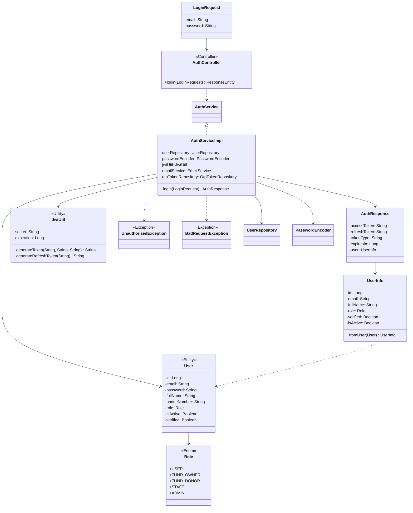
```mermaid
classDiagram
    class AuthController {
        <<Controller>>
        +login(LoginRequest) ResponseEntity
    }

    class LoginRequest {
        -email: String
        -password: String
    }

    class AuthServiceImpl {
        -userRepository: UserRepository
        -passwordEncoder: PasswordEncoder
        -jwtUtil: JwtUtil
        -emailService: EmailService
        -otpTokenRepository: OtpTokenRepository
        +login(LoginRequest) AuthResponse
    }

    class AuthResponse {
        -accessToken: String
        -refreshToken: String
        -tokenType: String
        -expiresIn: Long
        -user: UserInfo
    }

    class User {
        <<Entity>>
        -id: Long
        -email: String
        -password: String
        -fullName: String
        -phoneNumber: String
        -role: Role
        -isActive: Boolean
        -verified: Boolean
    }

    class UserInfo {
        -id: Long
        -email: String
        -fullName: String
        -role: Role
        -verified: Boolean
        -isActive: Boolean
        +fromUser(User) UserInfo
    }

    class JwtUtil {
        <<Utility>>
        -secret: String
        -expiration: Long
        +generateToken(String, String, String) String
        +generateRefreshToken(String) String
    }

    class Role {
        <<Enum>>
        +USER
        +FUND_OWNER
        +FUND_DONOR
        +STAFF
        +ADMIN
    }

    class UnauthorizedException {
        <<Exception>>
    }

    class BadRequestException {
        <<Exception>>
    }

    LoginRequest --> AuthController
    AuthController ..> AuthService
    AuthService <|.. AuthServiceImpl
    AuthServiceImpl --> UserRepository
    AuthServiceImpl --> PasswordEncoder
    AuthServiceImpl --> JwtUtil
    AuthServiceImpl --> AuthResponse
    AuthServiceImpl --> User
    AuthServiceImpl ..> UnauthorizedException
    AuthServiceImpl ..> BadRequestException
    AuthResponse --> UserInfo
    UserInfo ..> User
    User --> Role
```

### 2. Sequence Diagram - Login

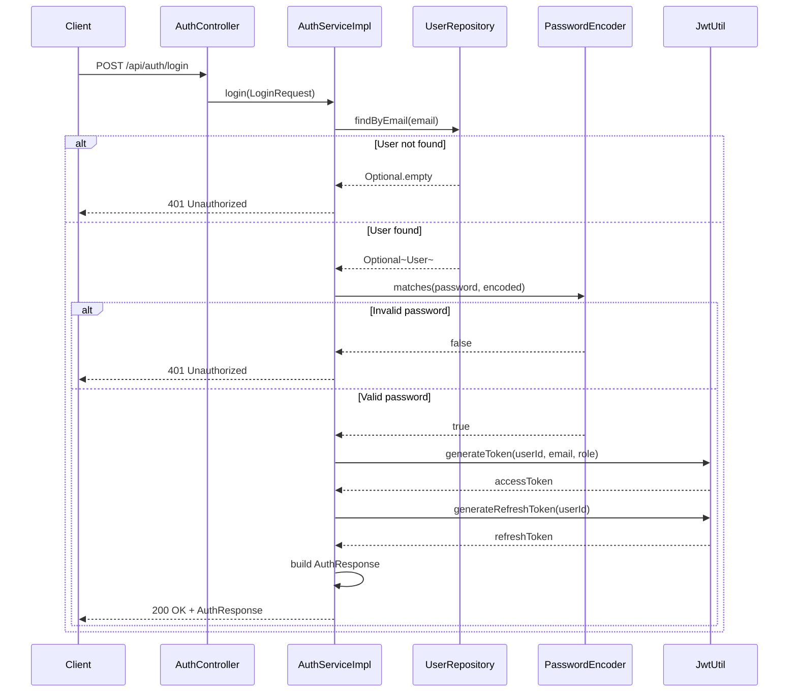
```mermaid
sequenceDiagram
    participant Client
    participant AuthController
    participant AuthServiceImpl
    participant UserRepository
    participant PasswordEncoder
    participant JwtUtil

    Client->>AuthController: POST /api/auth/login
    AuthController->>AuthServiceImpl: login(LoginRequest)

    AuthServiceImpl->>UserRepository: findByEmail(email)
    alt User not found
        UserRepository-->>AuthServiceImpl: Optional.empty
        AuthServiceImpl-->>Client: 401 Unauthorized
    else User found
        UserRepository-->>AuthServiceImpl: Optional~User~
        AuthServiceImpl->>PasswordEncoder: matches(password, encoded)

        alt Invalid password
            PasswordEncoder-->>AuthServiceImpl: false
            AuthServiceImpl-->>Client: 401 Unauthorized
        else Valid password
            PasswordEncoder-->>AuthServiceImpl: true
            AuthServiceImpl->>JwtUtil: generateToken(userId, email, role)
            JwtUtil-->>AuthServiceImpl: accessToken
            AuthServiceImpl->>JwtUtil: generateRefreshToken(userId)
            JwtUtil-->>AuthServiceImpl: refreshToken
            AuthServiceImpl->>AuthServiceImpl: build AuthResponse
            AuthServiceImpl-->>Client: 200 OK + AuthResponse
        end
    end
```

---

## Register Flow

### 1. Class Diagram - Register

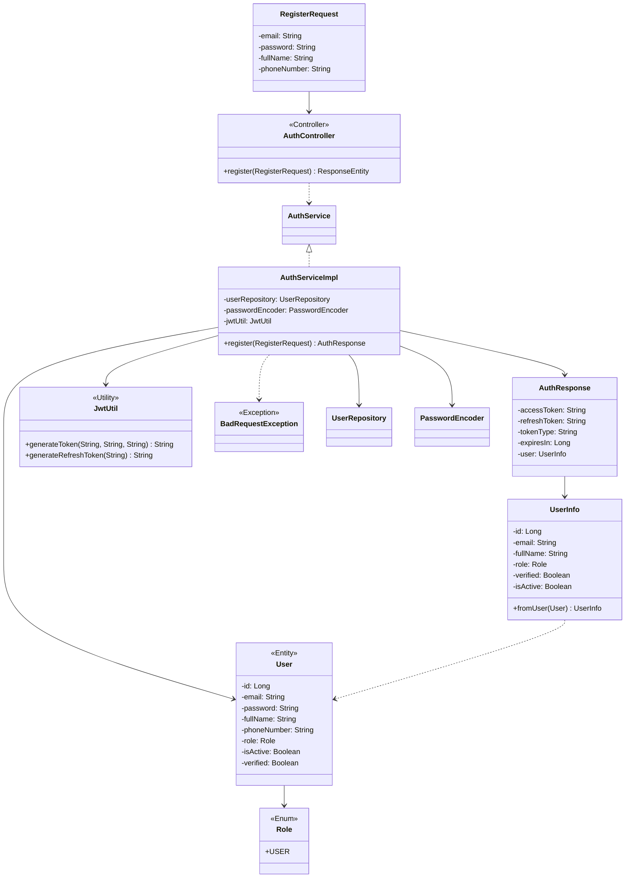
```mermaid
classDiagram
    class AuthController {
        <<Controller>>
        +register(RegisterRequest) ResponseEntity
    }

    class RegisterRequest {
        -email: String
        -password: String
        -fullName: String
        -phoneNumber: String
    }

    class AuthServiceImpl {
        -userRepository: UserRepository
        -passwordEncoder: PasswordEncoder
        -jwtUtil: JwtUtil
        +register(RegisterRequest) AuthResponse
    }

    class AuthResponse {
        -accessToken: String
        -refreshToken: String
        -tokenType: String
        -expiresIn: Long
        -user: UserInfo
    }

    class User {
        <<Entity>>
        -id: Long
        -email: String
        -password: String
        -fullName: String
        -phoneNumber: String
        -role: Role
        -isActive: Boolean
        -verified: Boolean
    }

    class UserInfo {
        -id: Long
        -email: String
        -fullName: String
        -role: Role
        -verified: Boolean
        -isActive: Boolean
        +fromUser(User) UserInfo
    }

    class JwtUtil {
        <<Utility>>
        +generateToken(String, String, String) String
        +generateRefreshToken(String) String
    }

    class Role {
        <<Enum>>
        +USER
    }

    class BadRequestException {
        <<Exception>>
    }

    RegisterRequest --> AuthController
    AuthController ..> AuthService
    AuthService <|.. AuthServiceImpl
    AuthServiceImpl --> UserRepository
    AuthServiceImpl --> PasswordEncoder
    AuthServiceImpl --> JwtUtil
    AuthServiceImpl --> AuthResponse
    AuthServiceImpl --> User
    AuthServiceImpl ..> BadRequestException
    AuthResponse --> UserInfo
    UserInfo ..> User
    User --> Role
```

### 2. Sequence Diagram - Register

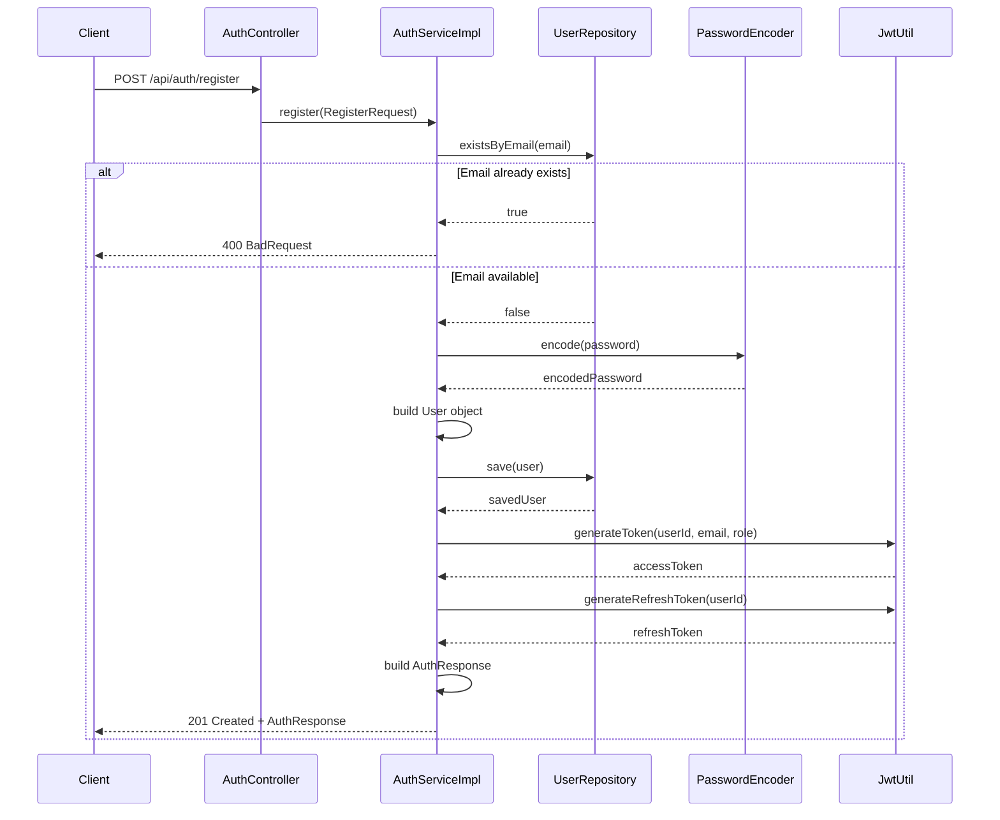
```mermaid
sequenceDiagram
    participant Client
    participant AuthController
    participant AuthServiceImpl
    participant UserRepository
    participant PasswordEncoder
    participant JwtUtil

    Client->>AuthController: POST /api/auth/register
    AuthController->>AuthServiceImpl: register(RegisterRequest)

    AuthServiceImpl->>UserRepository: existsByEmail(email)
    alt Email already exists
        UserRepository-->>AuthServiceImpl: true
        AuthServiceImpl-->>Client: 400 BadRequest
    else Email available
        UserRepository-->>AuthServiceImpl: false
        AuthServiceImpl->>PasswordEncoder: encode(password)
        PasswordEncoder-->>AuthServiceImpl: encodedPassword
        AuthServiceImpl->>AuthServiceImpl: build User object
        AuthServiceImpl->>UserRepository: save(user)
        UserRepository-->>AuthServiceImpl: savedUser
        AuthServiceImpl->>JwtUtil: generateToken(userId, email, role)
        JwtUtil-->>AuthServiceImpl: accessToken
        AuthServiceImpl->>JwtUtil: generateRefreshToken(userId)
        JwtUtil-->>AuthServiceImpl: refreshToken
        AuthServiceImpl->>AuthServiceImpl: build AuthResponse
        AuthServiceImpl-->>Client: 201 Created + AuthResponse
    end
```

---

## Donate Flow (Guest)

### 1. Class Diagram - Donate

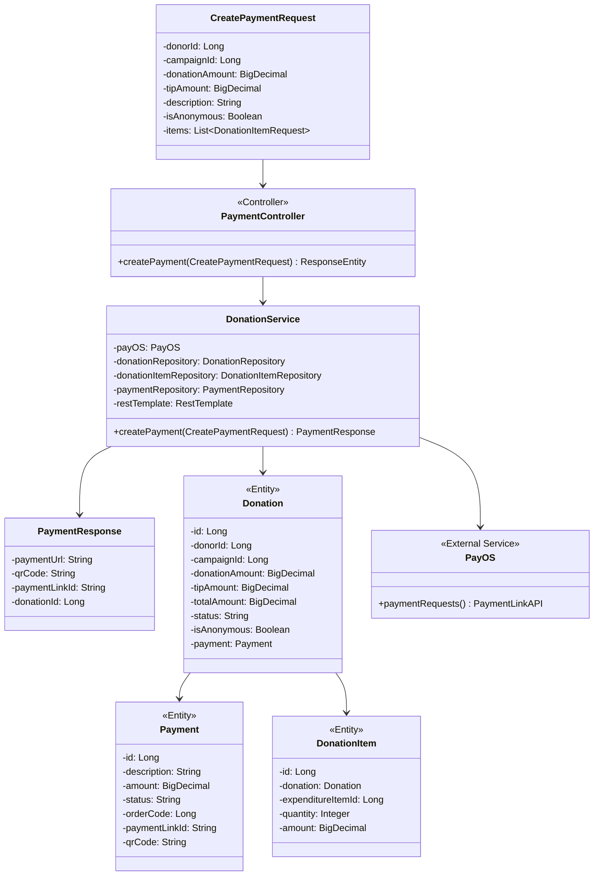
```mermaid
classDiagram
    class PaymentController {
        <<Controller>>
        +createPayment(CreatePaymentRequest) ResponseEntity
    }

    class CreatePaymentRequest {
        -donorId: Long
        -campaignId: Long
        -donationAmount: BigDecimal
        -tipAmount: BigDecimal
        -description: String
        -isAnonymous: Boolean
        -items: List~DonationItemRequest~
    }

    class DonationService {
        -payOS: PayOS
        -donationRepository: DonationRepository
        -donationItemRepository: DonationItemRepository
        -paymentRepository: PaymentRepository
        -restTemplate: RestTemplate
        +createPayment(CreatePaymentRequest) PaymentResponse
    }

    class PaymentResponse {
        -paymentUrl: String
        -qrCode: String
        -paymentLinkId: String
        -donationId: Long
    }

    class Donation {
        <<Entity>>
        -id: Long
        -donorId: Long
        -campaignId: Long
        -donationAmount: BigDecimal
        -tipAmount: BigDecimal
        -totalAmount: BigDecimal
        -status: String
        -isAnonymous: Boolean
        -payment: Payment
    }

    class Payment {
        <<Entity>>
        -id: Long
        -description: String
        -amount: BigDecimal
        -status: String
        -orderCode: Long
        -paymentLinkId: String
        -qrCode: String
    }

    class DonationItem {
        <<Entity>>
        -id: Long
        -donation: Donation
        -expenditureItemId: Long
        -quantity: Integer
        -amount: BigDecimal
    }

    class PayOS {
        <<External Service>>
        +paymentRequests() PaymentLinkAPI
    }

    CreatePaymentRequest --> PaymentController
    PaymentController --> DonationService
    DonationService --> Donation
    Donation --> Payment
    Donation --> DonationItem
    DonationService --> PayOS
    DonationService --> PaymentResponse
```

### 2. Sequence Diagram - Donate (Guest)

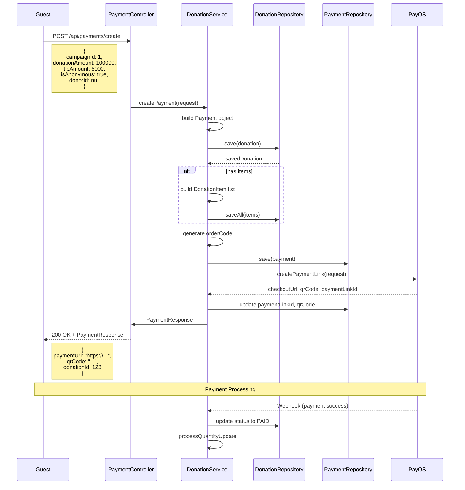
```mermaid
sequenceDiagram
    participant Guest
    participant PaymentController
    participant DonationService
    participant DonationRepository
    participant PaymentRepository
    participant PayOS

    Guest->>PaymentController: POST /api/payments/create
    Note right of Guest: {<br/>campaignId: 1,<br/>donationAmount: 100000,<br/>tipAmount: 5000,<br/>isAnonymous: true,<br/>donorId: null<br/>}

    PaymentController->>DonationService: createPayment(request)

    DonationService->>DonationService: build Payment object
    DonationService->>DonationRepository: save(donation)
    DonationRepository-->>DonationService: savedDonation

    alt has items
        DonationService->>DonationService: build DonationItem list
        DonationService->>DonationRepository: saveAll(items)
    end

    DonationService->>DonationService: generate orderCode
    DonationService->>PaymentRepository: save(payment)

    DonationService->>PayOS: createPaymentLink(request)
    PayOS-->>DonationService: checkoutUrl, qrCode, paymentLinkId

    DonationService->>PaymentRepository: update paymentLinkId, qrCode
    DonationService->>PaymentController: PaymentResponse

    PaymentController-->>Guest: 200 OK + PaymentResponse
    Note right of Guest: {<br/>paymentUrl: "https://...",<br/>qrCode: "...",<br/>donationId: 123<br/>}

    Note over Guest,PayOS: Payment Processing
    PayOS-->>DonationService: Webhook (payment success)
    DonationService->>DonationRepository: update status to PAID
    DonationService->>DonationService: processQuantityUpdate
```

---

## 4. View Campaign Details Page (Guest / Donor)

> **Trang chi tiết 1 campaign** - API: `GET /api/campaigns/{id}`

### 1. Class Diagram - Campaign Details Page

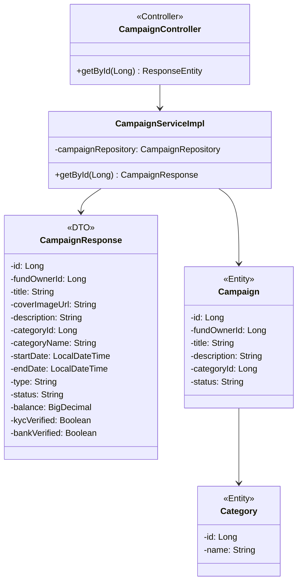
```mermaid
classDiagram
    class CampaignController {
        <<Controller>>
        +getById(Long) ResponseEntity
    }

    class CampaignServiceImpl {
        -campaignRepository: CampaignRepository
        +getById(Long) CampaignResponse
    }

    class CampaignResponse {
        <<DTO>>
        -id: Long
        -fundOwnerId: Long
        -title: String
        -coverImageUrl: String
        -description: String
        -categoryId: Long
        -categoryName: String
        -startDate: LocalDateTime
        -endDate: LocalDateTime
        -type: String
        -status: String
        -balance: BigDecimal
        -kycVerified: Boolean
        -bankVerified: Boolean
    }

    class Campaign {
        <<Entity>>
        -id: Long
        -fundOwnerId: Long
        -title: String
        -description: String
        -categoryId: Long
        -status: String
    }

    class Category {
        <<Entity>>
        -id: Long
        -name: String
    }

    CampaignController --> CampaignServiceImpl
    CampaignServiceImpl --> CampaignResponse
    CampaignServiceImpl --> Campaign
    Campaign --> Category
```

### 2. Sequence Diagram - Campaign Details Page

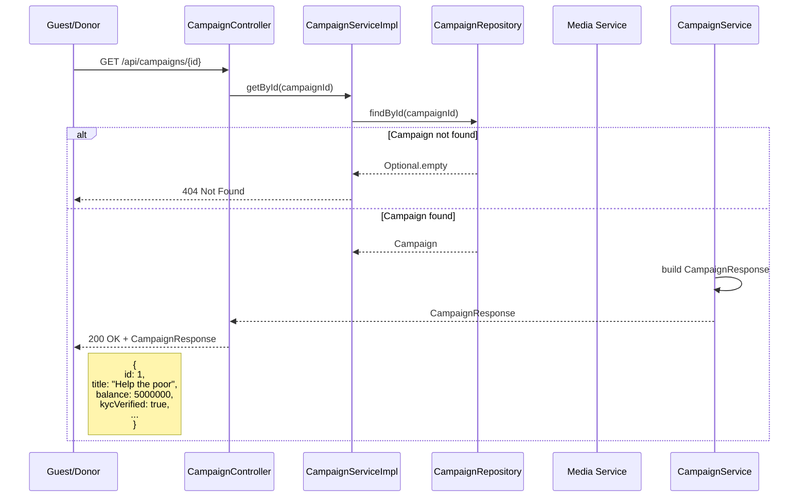
```mermaid
sequenceDiagram
    participant User as Guest/Donor
    participant CampaignController
    participant CampaignServiceImpl
    participant CampaignRepository
    participant External as Media Service

    User->>CampaignController: GET /api/campaigns/{id}

    CampaignController->>CampaignServiceImpl: getById(campaignId)

    CampaignServiceImpl->>CampaignRepository: findById(campaignId)
    alt Campaign not found
        CampaignRepository-->>CampaignServiceImpl: Optional.empty
        CampaignServiceImpl-->>User: 404 Not Found
    else Campaign found
        CampaignRepository-->>CampaignServiceImpl: Campaign

        CampaignService->>CampaignService: build CampaignResponse
        CampaignService-->>CampaignController: CampaignResponse

        CampaignController-->>User: 200 OK + CampaignResponse
        Note right of User: {<br/>id: 1,<br/>title: "Help the poor",<br/>balance: 5000000,<br/>kycVerified: true,<br/>...<br/>}
    end
```

---

## 5. View Campaigns List Page (Guest / Donor)

> **Trang danh sách tất cả campaigns** - API: `GET /api/campaigns`

### 1. Class Diagram - Campaigns List Page

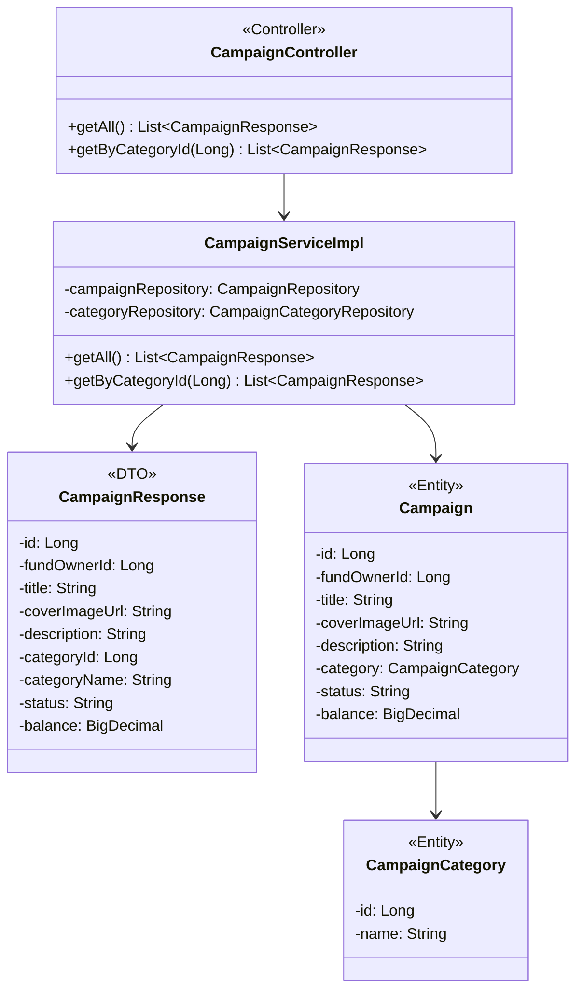
```mermaid
classDiagram
    class CampaignController {
        <<Controller>>
        +getAll() List~CampaignResponse~
        +getByCategoryId(Long) List~CampaignResponse~
    }

    class CampaignServiceImpl {
        -campaignRepository: CampaignRepository
        -categoryRepository: CampaignCategoryRepository
        +getAll() List~CampaignResponse~
        +getByCategoryId(Long) List~CampaignResponse~
    }

    class CampaignResponse {
        <<DTO>>
        -id: Long
        -fundOwnerId: Long
        -title: String
        -coverImageUrl: String
        -description: String
        -categoryId: Long
        -categoryName: String
        -status: String
        -balance: BigDecimal
    }

    class Campaign {
        <<Entity>>
        -id: Long
        -fundOwnerId: Long
        -title: String
        -coverImageUrl: String
        -description: String
        -category: CampaignCategory
        -status: String
        -balance: BigDecimal
    }

    class CampaignCategory {
        <<Entity>>
        -id: Long
        -name: String
    }

    CampaignController --> CampaignServiceImpl
    CampaignServiceImpl --> CampaignResponse
    CampaignServiceImpl --> Campaign
    Campaign --> CampaignCategory
```

### 2. Sequence Diagram - Campaigns List Page

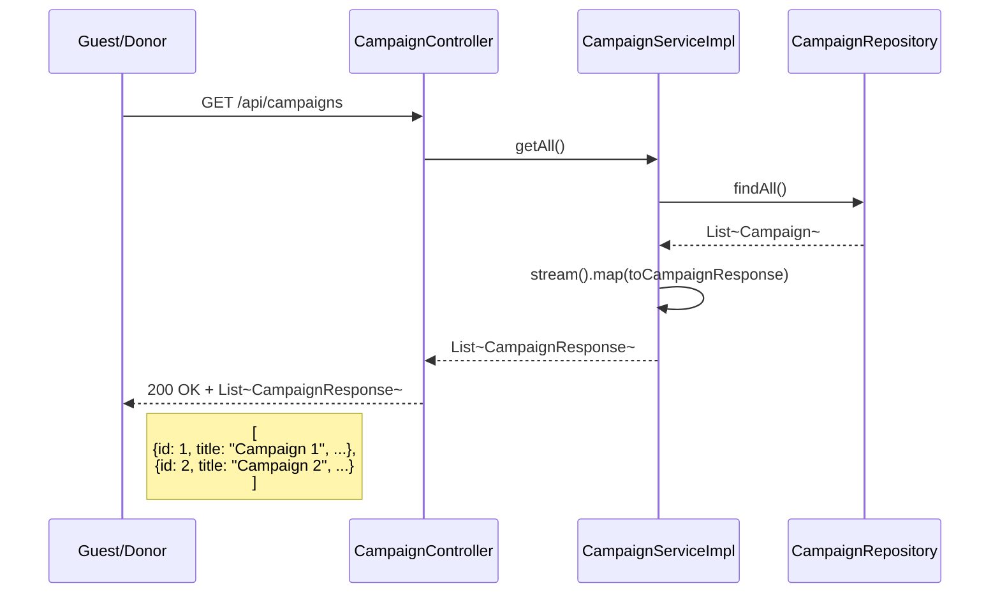
```mermaid
sequenceDiagram
    participant User as Guest/Donor
    participant CampaignController
    participant CampaignServiceImpl
    participant CampaignRepository

    User->>CampaignController: GET /api/campaigns

    CampaignController->>CampaignServiceImpl: getAll()

    CampaignServiceImpl->>CampaignRepository: findAll()
    CampaignRepository-->>CampaignServiceImpl: List~Campaign~

    CampaignServiceImpl->>CampaignServiceImpl: stream().map(toCampaignResponse)
    CampaignServiceImpl-->>CampaignController: List~CampaignResponse~

    CampaignController-->>User: 200 OK + List~CampaignResponse~
    Note right of User: [<br/>{id: 1, title: "Campaign 1", ...},<br/>{id: 2, title: "Campaign 2", ...}<br/>]
```

---

## 6. Filter Campaigns by Category (Guest / Donor)

### 1. Class Diagram - Filter Campaigns

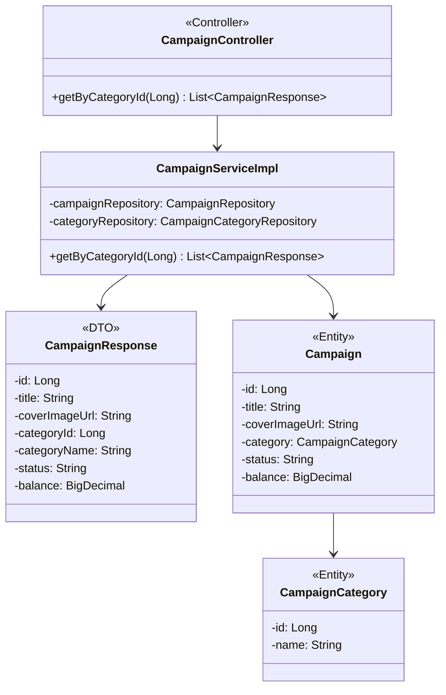
```mermaid
classDiagram
    class CampaignController {
        <<Controller>>
        +getByCategoryId(Long) List~CampaignResponse~
    }

    class CampaignServiceImpl {
        -campaignRepository: CampaignRepository
        -categoryRepository: CampaignCategoryRepository
        +getByCategoryId(Long) List~CampaignResponse~
    }

    class CampaignResponse {
        <<DTO>>
        -id: Long
        -title: String
        -coverImageUrl: String
        -categoryId: Long
        -categoryName: String
        -status: String
        -balance: BigDecimal
    }

    class Campaign {
        <<Entity>>
        -id: Long
        -title: String
        -coverImageUrl: String
        -category: CampaignCategory
        -status: String
        -balance: BigDecimal
    }

    class CampaignCategory {
        <<Entity>>
        -id: Long
        -name: String
    }

    CampaignController --> CampaignServiceImpl
    CampaignServiceImpl --> CampaignResponse
    CampaignServiceImpl --> Campaign
    Campaign --> CampaignCategory
```

### 2. Sequence Diagram - Filter Campaigns

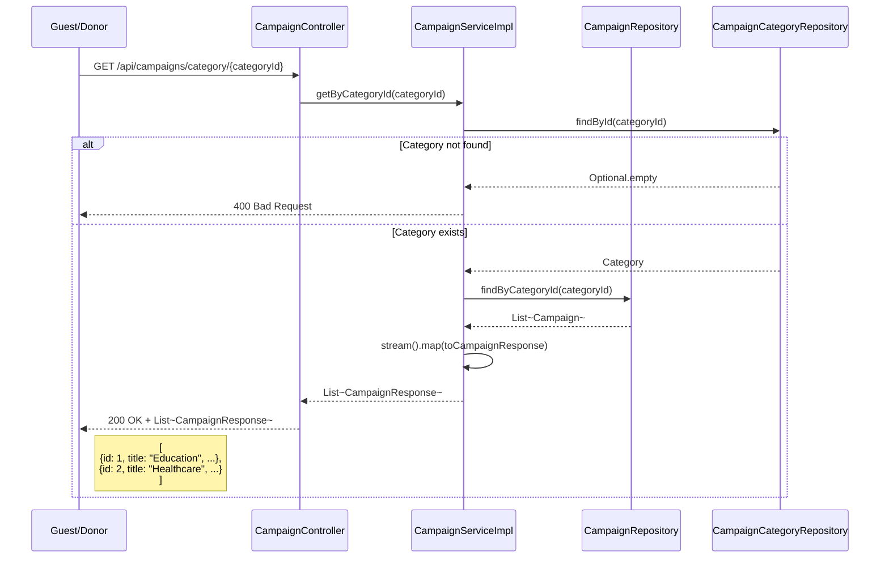
```mermaid
sequenceDiagram
    participant User as Guest/Donor
    participant CampaignController
    participant CampaignServiceImpl
    participant CampaignRepository
    participant CampaignCategoryRepository

    User->>CampaignController: GET /api/campaigns/category/{categoryId}

    CampaignController->>CampaignServiceImpl: getByCategoryId(categoryId)

    CampaignServiceImpl->>CampaignCategoryRepository: findById(categoryId)
    alt Category not found
        CampaignCategoryRepository-->>CampaignServiceImpl: Optional.empty
        CampaignServiceImpl-->>User: 400 Bad Request
    else Category exists
        CampaignCategoryRepository-->>CampaignServiceImpl: Category

        CampaignServiceImpl->>CampaignRepository: findByCategoryId(categoryId)
        CampaignRepository-->>CampaignServiceImpl: List~Campaign~

        CampaignServiceImpl->>CampaignServiceImpl: stream().map(toCampaignResponse)
        CampaignServiceImpl-->>CampaignController: List~CampaignResponse~

        CampaignController-->>User: 200 OK + List~CampaignResponse~
        Note right of User: [<br/>{id: 1, title: "Education", ...},<br/>{id: 2, title: "Healthcare", ...}<br/>]
    end
```

---

## 7. Create Comment (Donor)

> **Tạo bình luận trên feed post** - API: `POST /api/feed-posts/{postId}/comments`

### 1. Class Diagram - Create Comment

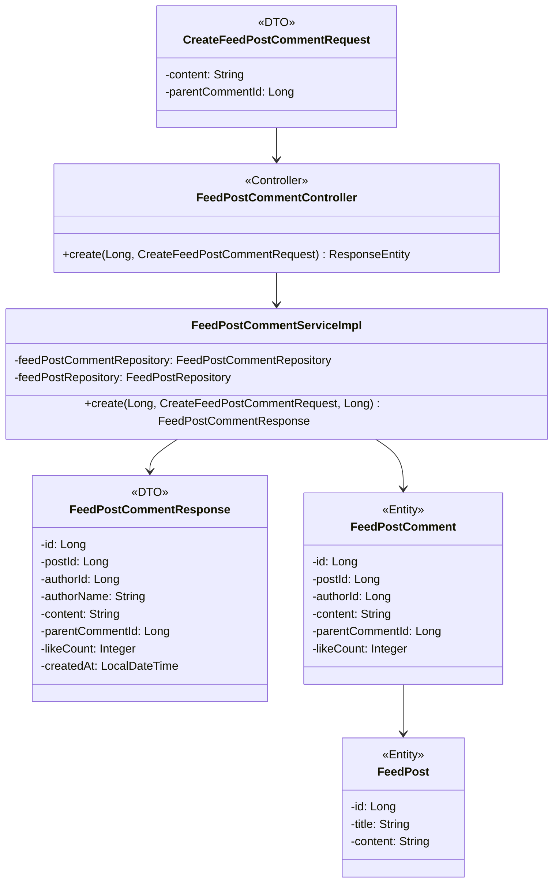
```mermaid
classDiagram
    class FeedPostCommentController {
        <<Controller>>
        +create(Long, CreateFeedPostCommentRequest) ResponseEntity
    }

    class CreateFeedPostCommentRequest {
        <<DTO>>
        -content: String
        -parentCommentId: Long
    }

    class FeedPostCommentServiceImpl {
        -feedPostCommentRepository: FeedPostCommentRepository
        -feedPostRepository: FeedPostRepository
        +create(Long, CreateFeedPostCommentRequest, Long) FeedPostCommentResponse
    }

    class FeedPostCommentResponse {
        <<DTO>>
        -id: Long
        -postId: Long
        -authorId: Long
        -authorName: String
        -content: String
        -parentCommentId: Long
        -likeCount: Integer
        -createdAt: LocalDateTime
    }

    class FeedPostComment {
        <<Entity>>
        -id: Long
        -postId: Long
        -authorId: Long
        -content: String
        -parentCommentId: Long
        -likeCount: Integer
    }

    class FeedPost {
        <<Entity>>
        -id: Long
        -title: String
        -content: String
    }

    CreateFeedPostCommentRequest --> FeedPostCommentController
    FeedPostCommentController --> FeedPostCommentServiceImpl
    FeedPostCommentServiceImpl --> FeedPostCommentResponse
    FeedPostCommentServiceImpl --> FeedPostComment
    FeedPostComment --> FeedPost
```

### 2. Sequence Diagram - Create Comment

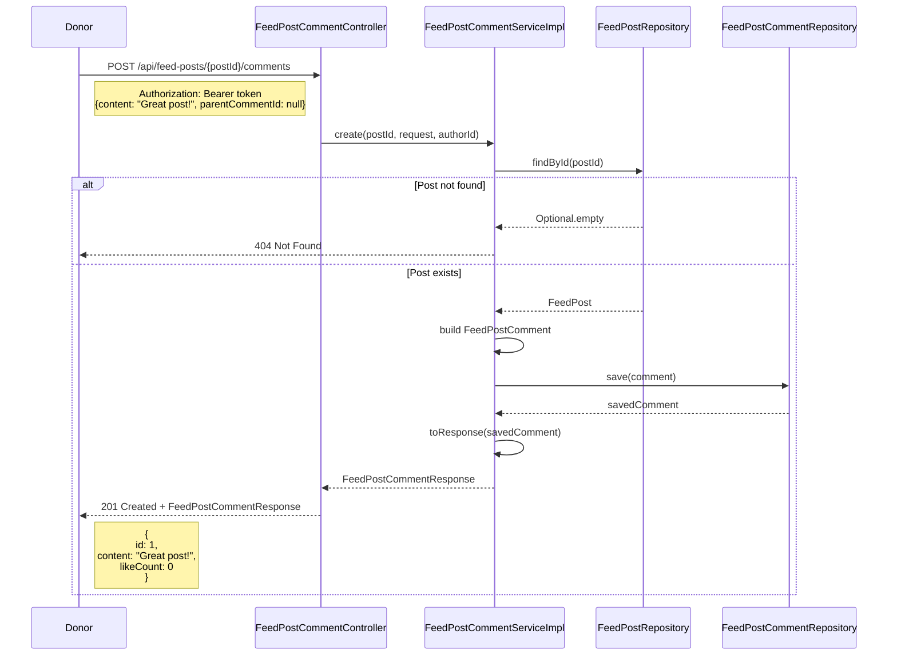
```mermaid
sequenceDiagram
    participant Donor
    participant FeedPostCommentController
    participant FeedPostCommentServiceImpl
    participant FeedPostRepository
    participant FeedPostCommentRepository

    Donor->>FeedPostCommentController: POST /api/feed-posts/{postId}/comments
    Note right of Donor: Authorization: Bearer token<br/>{content: "Great post!", parentCommentId: null}

    FeedPostCommentController->>FeedPostCommentServiceImpl: create(postId, request, authorId)

    FeedPostCommentServiceImpl->>FeedPostRepository: findById(postId)
    alt Post not found
        FeedPostRepository-->>FeedPostCommentServiceImpl: Optional.empty
        FeedPostCommentServiceImpl-->>Donor: 404 Not Found
    else Post exists
        FeedPostRepository-->>FeedPostCommentServiceImpl: FeedPost

        FeedPostCommentServiceImpl->>FeedPostCommentServiceImpl: build FeedPostComment
        FeedPostCommentServiceImpl->>FeedPostCommentRepository: save(comment)
        FeedPostCommentRepository-->>FeedPostCommentServiceImpl: savedComment

        FeedPostCommentServiceImpl->>FeedPostCommentServiceImpl: toResponse(savedComment)
        FeedPostCommentServiceImpl-->>FeedPostCommentController: FeedPostCommentResponse

        FeedPostCommentController-->>Donor: 201 Created + FeedPostCommentResponse
        Note right of Donor: {<br/>id: 1,<br/>content: "Great post!",<br/>likeCount: 0<br/>}
    end
```

---

## 8. Send Message (Donor → Staff)

> **Gửi tin nhắn cho Staff** - API: `POST /api/conversations/{conversationId}/messages`

### 1. Class Diagram - Send Message

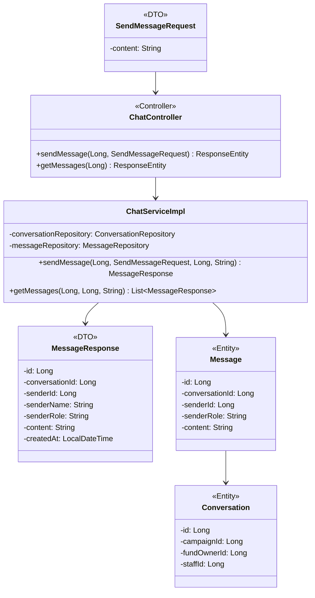
```mermaid
classDiagram
    class ChatController {
        <<Controller>>
        +sendMessage(Long, SendMessageRequest) ResponseEntity
        +getMessages(Long) ResponseEntity
    }

    class SendMessageRequest {
        <<DTO>>
        -content: String
    }

    class ChatServiceImpl {
        -conversationRepository: ConversationRepository
        -messageRepository: MessageRepository
        +sendMessage(Long, SendMessageRequest, Long, String) MessageResponse
        +getMessages(Long, Long, String) List~MessageResponse~
    }

    class MessageResponse {
        <<DTO>>
        -id: Long
        -conversationId: Long
        -senderId: Long
        -senderName: String
        -senderRole: String
        -content: String
        -createdAt: LocalDateTime
    }

    class Message {
        <<Entity>>
        -id: Long
        -conversationId: Long
        -senderId: Long
        -senderRole: String
        -content: String
    }

    class Conversation {
        <<Entity>>
        -id: Long
        -campaignId: Long
        -fundOwnerId: Long
        -staffId: Long
    }

    SendMessageRequest --> ChatController
    ChatController --> ChatServiceImpl
    ChatServiceImpl --> MessageResponse
    ChatServiceImpl --> Message
    Message --> Conversation
```

### 2. Sequence Diagram - Send Message

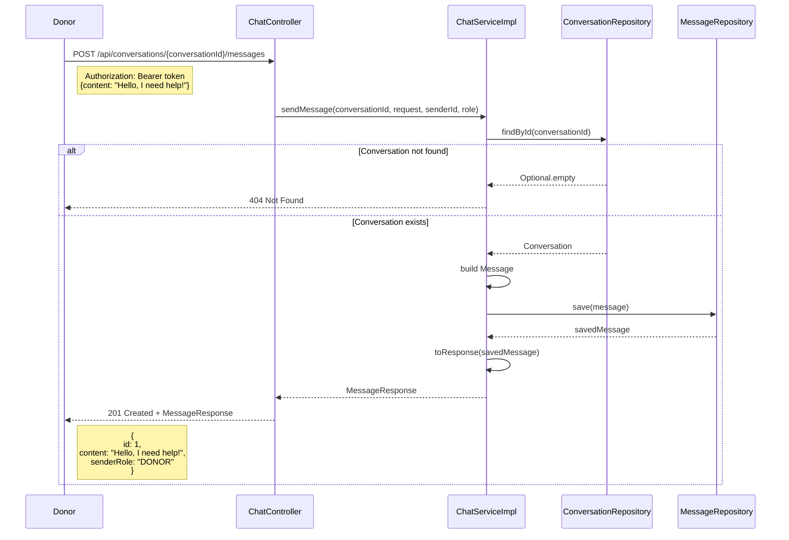
```mermaid
sequenceDiagram
    participant Donor
    participant ChatController
    participant ChatServiceImpl
    participant ConversationRepository
    participant MessageRepository

    Donor->>ChatController: POST /api/conversations/{conversationId}/messages
    Note right of Donor: Authorization: Bearer token<br/>{content: "Hello, I need help!"}

    ChatController->>ChatServiceImpl: sendMessage(conversationId, request, senderId, role)

    ChatServiceImpl->>ConversationRepository: findById(conversationId)
    alt Conversation not found
        ConversationRepository-->>ChatServiceImpl: Optional.empty
        ChatServiceImpl-->>Donor: 404 Not Found
    else Conversation exists
        ConversationRepository-->>ChatServiceImpl: Conversation

        ChatServiceImpl->>ChatServiceImpl: build Message
        ChatServiceImpl->>MessageRepository: save(message)
        MessageRepository-->>ChatServiceImpl: savedMessage

        ChatServiceImpl->>ChatServiceImpl: toResponse(savedMessage)
        ChatServiceImpl-->>ChatController: MessageResponse

        ChatController-->>Donor: 201 Created + MessageResponse
        Note right of Donor: {<br/>id: 1,<br/>content: "Hello, I need help!",<br/>senderRole: "DONOR"<br/>}
    end
```

---

## 9. View Appointment Schedule (Donor)

> **Xem lịch hẹn của Donor** - API: `GET /api/appointments/donor/{donorId}`

### 1. Class Diagram - View Appointment Schedule

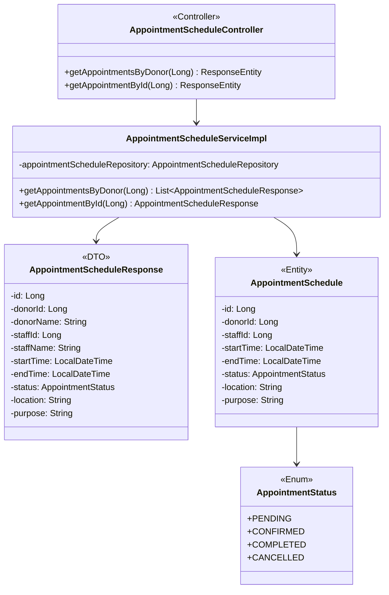
```mermaid
classDiagram
    class AppointmentScheduleController {
        <<Controller>>
        +getAppointmentsByDonor(Long) ResponseEntity
        +getAppointmentById(Long) ResponseEntity
    }

    class AppointmentScheduleServiceImpl {
        -appointmentScheduleRepository: AppointmentScheduleRepository
        +getAppointmentsByDonor(Long) List~AppointmentScheduleResponse~
        +getAppointmentById(Long) AppointmentScheduleResponse
    }

    class AppointmentScheduleResponse {
        <<DTO>>
        -id: Long
        -donorId: Long
        -donorName: String
        -staffId: Long
        -staffName: String
        -startTime: LocalDateTime
        -endTime: LocalDateTime
        -status: AppointmentStatus
        -location: String
        -purpose: String
    }

    class AppointmentSchedule {
        <<Entity>>
        -id: Long
        -donorId: Long
        -staffId: Long
        -startTime: LocalDateTime
        -endTime: LocalDateTime
        -status: AppointmentStatus
        -location: String
        -purpose: String
    }

    class AppointmentStatus {
        <<Enum>>
        +PENDING
        +CONFIRMED
        +COMPLETED
        +CANCELLED
    }

    AppointmentScheduleController --> AppointmentScheduleServiceImpl
    AppointmentScheduleServiceImpl --> AppointmentScheduleResponse
    AppointmentScheduleServiceImpl --> AppointmentSchedule
    AppointmentSchedule --> AppointmentStatus
```

### 2. Sequence Diagram - View Appointment Schedule

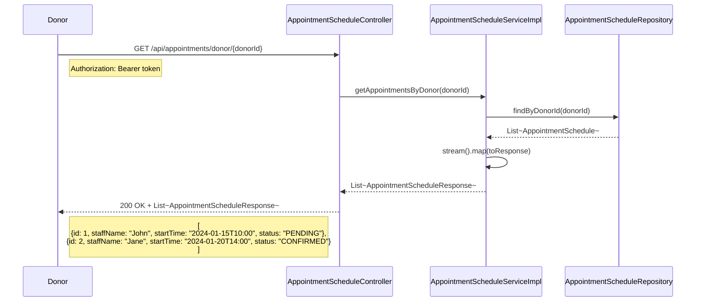
```mermaid
sequenceDiagram
    participant Donor
    participant AppointmentScheduleController
    participant AppointmentScheduleServiceImpl
    participant AppointmentScheduleRepository

    Donor->>AppointmentScheduleController: GET /api/appointments/donor/{donorId}
    Note right of Donor: Authorization: Bearer token

    AppointmentScheduleController->>AppointmentScheduleServiceImpl: getAppointmentsByDonor(donorId)

    AppointmentScheduleServiceImpl->>AppointmentScheduleRepository: findByDonorId(donorId)
    AppointmentScheduleRepository-->>AppointmentScheduleServiceImpl: List~AppointmentSchedule~

    AppointmentScheduleServiceImpl->>AppointmentScheduleServiceImpl: stream().map(toResponse)
    AppointmentScheduleServiceImpl-->>AppointmentScheduleController: List~AppointmentScheduleResponse~

    AppointmentScheduleController-->>Donor: 200 OK + List~AppointmentScheduleResponse~
    Note right of Donor: [<br/>{id: 1, staffName: "John", startTime: "2024-01-15T10:00", status: "PENDING"},<br/>{id: 2, staffName: "Jane", startTime: "2024-01-20T14:00", status: "CONFIRMED"}<br/>]
```

---

## View Expenditure Details Flow (Donor)

### 1. Class Diagram - View Expenditure Details

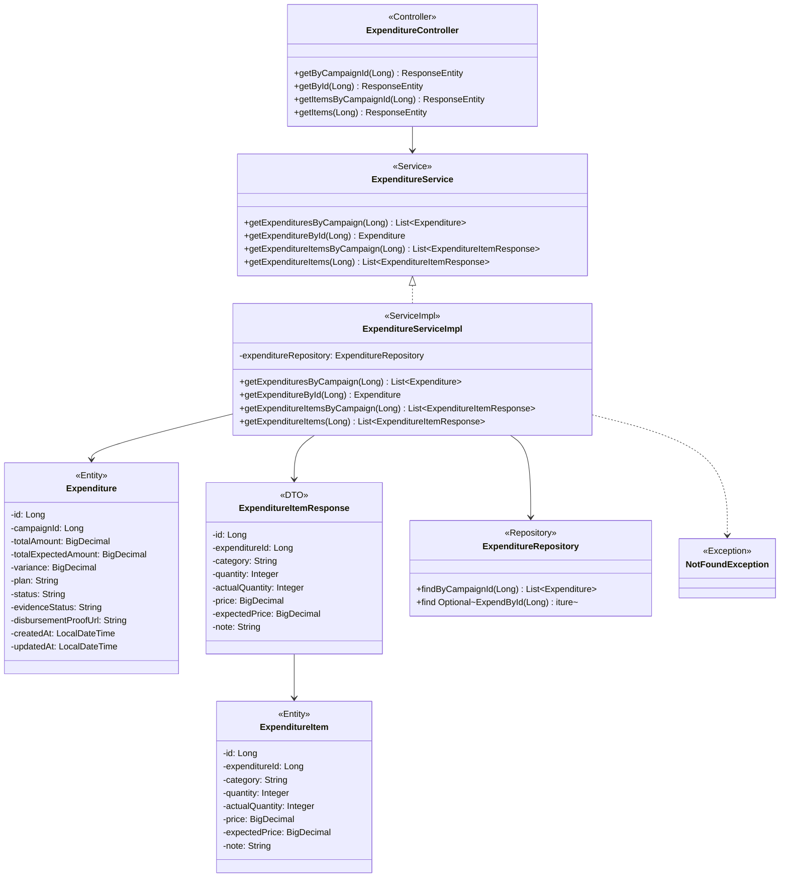
```mermaid
classDiagram
    class ExpenditureController {
        <<Controller>>
        +getByCampaignId(Long) ResponseEntity
        +getById(Long) ResponseEntity
        +getItemsByCampaignId(Long) ResponseEntity
        +getItems(Long) ResponseEntity
    }

    class ExpenditureService {
        <<Service>>
        +getExpendituresByCampaign(Long) List~Expenditure~
        +getExpenditureById(Long) Expenditure
        +getExpenditureItemsByCampaign(Long) List~ExpenditureItemResponse~
        +getExpenditureItems(Long) List~ExpenditureItemResponse~
    }

    class ExpenditureServiceImpl {
        <<ServiceImpl>>
        -expenditureRepository: ExpenditureRepository
        +getExpendituresByCampaign(Long) List~Expenditure~
        +getExpenditureById(Long) Expenditure
        +getExpenditureItemsByCampaign(Long) List~ExpenditureItemResponse~
        +getExpenditureItems(Long) List~ExpenditureItemResponse~
    }

    class Expenditure {
        <<Entity>>
        -id: Long
        -campaignId: Long
        -totalAmount: BigDecimal
        -totalExpectedAmount: BigDecimal
        -variance: BigDecimal
        -plan: String
        -status: String
        -evidenceStatus: String
        -disbursementProofUrl: String
        -createdAt: LocalDateTime
        -updatedAt: LocalDateTime
    }

    class ExpenditureItem {
        <<Entity>>
        -id: Long
        -expenditureId: Long
        -category: String
        -quantity: Integer
        -actualQuantity: Integer
        -price: BigDecimal
        -expectedPrice: BigDecimal
        -note: String
    }

    class ExpenditureItemResponse {
        <<DTO>>
        -id: Long
        -expenditureId: Long
        -category: String
        -quantity: Integer
        -actualQuantity: Integer
        -price: BigDecimal
        -expectedPrice: BigDecimal
        -note: String
    }

    class ExpenditureRepository {
        <<Repository>>
        +findByCampaignId(Long) List~Expenditure~
        +find Optional~ExpendById(Long)iture~
    }

    class NotFoundException {
        <<Exception>>
    }

    ExpenditureController --> ExpenditureService
    ExpenditureService <|.. ExpenditureServiceImpl
    ExpenditureServiceImpl --> ExpenditureRepository
    ExpenditureServiceImpl --> Expenditure
    ExpenditureServiceImpl --> ExpenditureItemResponse
    ExpenditureItemResponse --> ExpenditureItem
    ExpenditureServiceImpl ..> NotFoundException
```

### 2. Sequence Diagram - View Expenditure Details

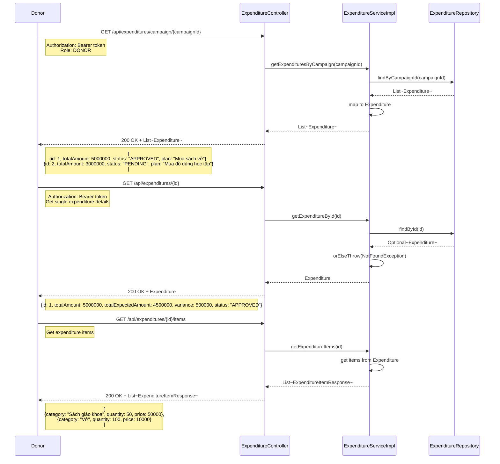
```mermaid
sequenceDiagram
    participant Donor
    participant ExpenditureController
    participant ExpenditureServiceImpl
    participant ExpenditureRepository

    Donor->>ExpenditureController: GET /api/expenditures/campaign/{campaignId}
    Note right of Donor: Authorization: Bearer token<br/>Role: DONOR

    ExpenditureController->>ExpenditureServiceImpl: getExpendituresByCampaign(campaignId)

    ExpenditureServiceImpl->>ExpenditureRepository: findByCampaignId(campaignId)
    ExpenditureRepository-->>ExpenditureServiceImpl: List~Expenditure~

    ExpenditureServiceImpl->>ExpenditureServiceImpl: map to Expenditure
    ExpenditureServiceImpl-->>ExpenditureController: List~Expenditure~

    ExpenditureController-->>Donor: 200 OK + List~Expenditure~
    Note right of Donor: [<br/>{id: 1, totalAmount: 5000000, status: "APPROVED", plan: "Mua sách vở"},<br/>{id: 2, totalAmount: 3000000, status: "PENDING", plan: "Mua đồ dùng học tập"}<br/>]

    Donor->>ExpenditureController: GET /api/expenditures/{id}
    Note right of Donor: Authorization: Bearer token<br/>Get single expenditure details

    ExpenditureController->>ExpenditureServiceImpl: getExpenditureById(id)

    ExpenditureServiceImpl->>ExpenditureRepository: findById(id)
    ExpenditureRepository-->>ExpenditureServiceImpl: Optional~Expenditure~

    ExpenditureServiceImpl->>ExpenditureServiceImpl: orElseThrow(NotFoundException)
    ExpenditureServiceImpl-->>ExpenditureController: Expenditure

    ExpenditureController-->>Donor: 200 OK + Expenditure
    Note right of Donor: {id: 1, totalAmount: 5000000, totalExpectedAmount: 4500000, variance: 500000, status: "APPROVED"}

    Donor->>ExpenditureController: GET /api/expenditures/{id}/items
    Note right of Donor: Get expenditure items

    ExpenditureController->>ExpenditureServiceImpl: getExpenditureItems(id)

    ExpenditureServiceImpl->>ExpenditureServiceImpl: get items from Expenditure
    ExpenditureServiceImpl-->>ExpenditureController: List~ExpenditureItemResponse~

    ExpenditureController-->>Donor: 200 OK + List~ExpenditureItemResponse~
    Note right of Donor: [<br/>{category: "Sách giáo khoa", quantity: 50, price: 50000},<br/>{category: "Vở", quantity: 100, price: 10000}<br/>]
```

---

## View Report Status Flow (Donor)

### 1. Class Diagram - View Report Status

```mermaid
classDiagram
    class FlagController {
        <<Controller>>
        +getMyFlags(int, int) ResponseEntity
    }

    class FlagService {
        <<Service>>
        +getFlagsByUserId(Long, Pageable) Page~FlagResponse~
    }

    class FlagServiceImpl {
        <<ServiceImpl>>
        -flagRepository: FlagRepository
        +getFlagsByUserId(Long, Pageable) Page~FlagResponse~
    }

    class Flag {
        <<Entity>>
        -id: Long
        -campaignId: Long
        -postId: Long
        -userId: Long
        -reason: String
        -status: String
        -reviewedBy: Long
        -createdAt: LocalDateTime
    }

    class FlagResponse {
        <<DTO>>
        -id: Long
        -campaignId: Long
        -postId: Long
        -userId: Long
        -reason: String
        -status: String
        -reviewedBy: Long
        -createdAt: LocalDateTime
    }

    class FlagRepository {
        <<Repository>>
        +findByUserId(Long, Pageable) Page~Flag~
    }

    FlagController --> FlagService
    FlagService <|.. FlagServiceImpl
    FlagServiceImpl --> FlagRepository
    FlagServiceImpl --> Flag
    FlagServiceImpl --> FlagResponse
    FlagResponse --> Flag
```

### 2. Sequence Diagram - View Report Status

```mermaid
sequenceDiagram
    participant Donor
    participant FlagController
    participant FlagServiceImpl
    participant FlagRepository

    Donor->>FlagController: GET /api/flags/me?page=0&size=10
    Note right of Donor: Authorization: Bearer token<br/>Role: DONOR<br/>Get my submitted flags

    FlagController->>FlagServiceImpl: getFlagsByUserId(userId, pageable)

    FlagServiceImpl->>FlagRepository: findByUserId(userId, pageable)
    FlagRepository-->>FlagServiceImpl: Page~Flag~

    FlagServiceImpl->>FlagServiceImpl: map to FlagResponse
    FlagServiceImpl-->>FlagController: Page~FlagResponse~

    FlagController-->>Donor: 200 OK + Page~FlagResponse~
    Note right of Donor: {<br/>content: [<br/>{id: 1, campaignId: 5, reason: "Chiến dịch lừa đảo", status: "PENDING", createdAt: "2024-01-10"},<br/>{id: 2, postId: 10, reason: "Nội dung không phù hợp", status: "RESOLVED", reviewedBy: 1, createdAt: "2024-01-05"}<br/>],<br/>totalElements: 2,<br/>totalPages: 1<br/>}
```

---

## Follow Campaign Flow (Donor)

### 1. Class Diagram - Follow Campaign

```mermaid
classDiagram
    class CampaignFollowController {
        <<Controller>>
        +follow(Long) ResponseEntity
    }

    class CampaignFollowService {
        <<Service>>
        +follow(Long, Long) void
    }

    class CampaignFollowServiceImpl {
        <<ServiceImpl>>
        -campaignFollowRepository: CampaignFollowRepository
        -campaignRepository: CampaignRepository
        +follow(Long, Long) void
    }

    class CampaignFollow {
        <<Entity>>
        -id: CampaignFollowId
        -followedAt: LocalDateTime
    }

    class CampaignFollowId {
        <<Embeddable>>
        -campaignId: Long
        -userId: Long
    }

    class Campaign {
        <<Entity>>
        -id: Long
        -title: String
        -status: String
    }

    class CampaignFollowRepository {
        <<Repository>>
        +save(CampaignFollow) CampaignFollow
        +existsById(CampaignFollowId) boolean
    }

    class CampaignRepository {
        <<Repository>>
        +findById(Long) Optional~Campaign~
    }

    class DataIntegrityViolationException {
        <<Exception>>
    }

    CampaignFollowController --> CampaignFollowService
    CampaignFollowService <|.. CampaignFollowServiceImpl
    CampaignFollowServiceImpl --> CampaignFollowRepository
    CampaignFollowServiceImpl --> CampaignRepository
    CampaignFollowServiceImpl --> CampaignFollow
    CampaignFollow --> CampaignFollowId
    CampaignFollowServiceImpl ..> DataIntegrityViolationException
```

### 2. Sequence Diagram - Follow Campaign

```mermaid
sequenceDiagram
    participant Donor
    participant CampaignFollowController
    participant CampaignFollowServiceImpl
    participant CampaignFollowRepository
    participant CampaignRepository

    Donor->>CampaignFollowController: POST /api/campaign-follows/{campaignId}
    Note right of Donor: Authorization: Bearer token<br/>Role: DONOR

    CampaignFollowController->>CampaignFollowServiceImpl: follow(campaignId, userId)

    CampaignFollowServiceImpl->>CampaignRepository: findById(campaignId)
    CampaignRepository-->>CampaignFollowServiceImpl: Optional~Campaign~

    CampaignFollowServiceImpl->>CampaignFollowServiceImpl: check campaign exists
    CampaignFollowServiceImpl->>CampaignFollowServiceImpl: create CampaignFollowId(campaignId, userId)
    CampaignFollowServiceImpl->>CampaignFollowRepository: save(campaignFollow)
    CampaignFollowRepository-->>CampaignFollowServiceImpl: CampaignFollow

    CampaignFollowController-->>Donor: 204 No Content
    Note right of Donor: Successfully followed campaign
```

---

## View Followed Campaigns Flow (Donor)

### 1. Class Diagram - View Followed Campaigns

```mermaid
classDiagram
    class CampaignFollowController {
        <<Controller>>
        +getMyFollowedCampaignIds() ResponseEntity
    }

    class CampaignFollowService {
        <<Service>>
        +getMyFollowedCampaignIds(Long) List~Long~
    }

    class CampaignFollowServiceImpl {
        <<ServiceImpl>>
        -campaignFollowRepository: CampaignFollowRepository
        -campaignRepository: CampaignRepository
        +getMyFollowedCampaignIds(Long) List~Long~
    }

    class CampaignFollow {
        <<Entity>>
        -id: CampaignFollowId
        -followedAt: LocalDateTime
    }

    class CampaignFollowId {
        <<Embeddable>>
        -campaignId: Long
        -userId: Long
    }

    class Campaign {
        <<Entity>>
        -id: Long
        -title: String
        -targetAmount: BigDecimal
        -currentAmount: BigDecimal
        -status: String
    }

    class CampaignRepository {
        <<Repository>>
        +findById(Long) Optional~Campaign~
    }

    class CampaignFollowRepository {
        <<Repository>>
        +findByIdUserId(Long) List~CampaignFollow~
    }

    CampaignFollowController --> CampaignFollowService
    CampaignFollowService <|.. CampaignFollowServiceImpl
    CampaignFollowServiceImpl --> CampaignFollowRepository
    CampaignFollowServiceImpl --> CampaignRepository
    CampaignFollowServiceImpl --> Campaign
    CampaignFollow --> CampaignFollowId
```

### 2. Sequence Diagram - View Followed Campaigns

```mermaid
sequenceDiagram
    participant Donor
    participant CampaignFollowController
    participant CampaignFollowServiceImpl
    participant CampaignFollowRepository
    participant CampaignRepository

    Donor->>CampaignFollowController: GET /api/campaign-follows/me
    Note right of Donor: Authorization: Bearer token<br/>Role: DONOR

    CampaignFollowController->>CampaignFollowServiceImpl: getMyFollowedCampaignIds(userId)

    CampaignFollowServiceImpl->>CampaignFollowRepository: findByIdUserId(userId)
    CampaignFollowRepository-->>CampaignFollowServiceImpl: List~CampaignFollow~

    CampaignFollowServiceImpl->>CampaignFollowServiceImpl: map to campaignIds
    CampaignFollowServiceImpl-->>CampaignFollowController: List~Long~

    CampaignFollowController-->>Donor: 200 OK + List~Long~
    Note right of Donor: [1, 5, 10]<br/>List of followed campaign IDs
```

---

## Unfollow Campaign Flow (Donor)

### 1. Class Diagram - Unfollow Campaign

```mermaid
classDiagram
    class CampaignFollowController {
        <<Controller>>
        +unfollow(Long) ResponseEntity
    }

    class CampaignFollowService {
        <<Service>>
        +unfollow(Long, Long) void
    }

    class CampaignFollowServiceImpl {
        <<ServiceImpl>>
        -campaignFollowRepository: CampaignFollowRepository
        +unfollow(Long, Long) void
    }

    class CampaignFollow {
        <<Entity>>
        -id: CampaignFollowId
        -followedAt: LocalDateTime
    }

    class CampaignFollowId {
        <<Embeddable>>
        -campaignId: Long
        -userId: Long
    }

    class CampaignFollowRepository {
        <<Repository>>
        +deleteById(CampaignFollowId) void
        +existsById(CampaignFollowId) boolean
    }

    class EmptyResultDataAccessException {
        <<Exception>>
    }

    CampaignFollowController --> CampaignFollowService
    CampaignFollowService <|.. CampaignFollowServiceImpl
    CampaignFollowServiceImpl --> CampaignFollowRepository
    CampaignFollowServiceImpl --> CampaignFollow
    CampaignFollow --> CampaignFollowId
    CampaignFollowServiceImpl ..> EmptyResultDataAccessException
```

### 2. Sequence Diagram - Unfollow Campaign

```mermaid
sequenceDiagram
    participant Donor
    participant CampaignFollowController
    participant CampaignFollowServiceImpl
    participant CampaignFollowRepository

    Donor->>CampaignFollowController: DELETE /api/campaign-follows/{campaignId}
    Note right of Donor: Authorization: Bearer token<br/>Role: DONOR

    CampaignFollowController->>CampaignFollowServiceImpl: unfollow(campaignId, userId)

    CampaignFollowServiceImpl->>CampaignFollowServiceImpl: create CampaignFollowId(campaignId, userId)
    CampaignFollowServiceImpl->>CampaignFollowRepository: deleteById(campaignFollowId)

    CampaignFollowController-->>Donor: 204 No Content
    Note right of Donor: Successfully unfollowed campaign
```

---

## Report Campaign Flow (Donor)

### 1. Class Diagram - Report Campaign

```mermaid
classDiagram
    class FlagController {
        <<Controller>>
        +submitFlag(FlagRequest) ResponseEntity
    }

    class FlagService {
        <<Service>>
        +submitFlag(Long, FlagRequest) FlagResponse
    }

    class FlagServiceImpl {
        <<ServiceImpl>>
        -flagRepository: FlagRepository
        -campaignRepository: CampaignRepository
        +submitFlag(Long, FlagRequest) FlagResponse
    }

    class Flag {
        <<Entity>>
        -id: Long
        -campaignId: Long
        -postId: Long
        -userId: Long
        -reason: String
        -status: String
        -reviewedBy: Long
        -createdAt: LocalDateTime
    }

    class FlagRequest {
        <<DTO>>
        -campaignId: Long
        -postId: Long
        -reason: String
    }

    class FlagResponse {
        <<DTO>>
        -id: Long
        -campaignId: Long
        -userId: Long
        -reason: String
        -status: String
        -createdAt: LocalDateTime
    }

    class FlagRepository {
        <<Repository>>
        +save(Flag) Flag
    }

    class CampaignRepository {
        <<Repository>>
        +findById(Long) Optional~Campaign~
    }

    class BadRequestException {
        <<Exception>>
    }

    FlagController --> FlagService
    FlagService <|.. FlagServiceImpl
    FlagServiceImpl --> FlagRepository
    FlagServiceImpl --> CampaignRepository
    FlagServiceImpl --> Flag
    FlagServiceImpl --> FlagRequest
    FlagServiceImpl --> FlagResponse
    FlagResponse --> Flag
    FlagServiceImpl ..> BadRequestException
```

### 2. Sequence Diagram - Report Campaign

```mermaid
sequenceDiagram
    participant Donor
    participant FlagController
    participant FlagServiceImpl
    participant FlagRepository
    participant CampaignRepository

    Donor->>FlagController: POST /api/flags
    Note right of Donor: Authorization: Bearer token<br/>Role: DONOR<br/>{campaignId: 1, reason: "Chiến dịch có nội dung không phù hợp"}

    FlagController->>FlagServiceImpl: submitFlag(userId, request)

    FlagServiceImpl->>FlagServiceImpl: validate (campaignId or postId required)
    FlagServiceImpl->>CampaignRepository: findById(campaignId)
    CampaignRepository-->>FlagServiceImpl: Optional~Campaign~

    FlagServiceImpl->>FlagServiceImpl: build Flag entity
    FlagServiceImpl->>FlagRepository: save(flag)
    FlagRepository-->>FlagServiceImpl: Flag

    FlagServiceImpl->>FlagServiceImpl: toResponse(flag)
    FlagServiceImpl-->>FlagController: FlagResponse

    FlagController-->>Donor: 201 Created + FlagResponse
    Note right of Donor: {<br/>id: 1,<br/>campaignId: 1,<br/>userId: 5,<br/>reason: "Chiến dịch có nội dung không phù hợp",<br/>status: "PENDING"<br/>}
```

---

## Donate to Campaign Flow (Donor)

### 1. Class Diagram - Donate to Campaign

```mermaid
classDiagram
    class PaymentController {
        <<Controller>>
        +createPayment(CreatePaymentRequest) ResponseEntity
        +getDonation(Long) ResponseEntity
    }

    class DonationService {
        <<Service>>
        +createPayment(CreatePaymentRequest) PaymentResponse
        +getDonation(Long) PaymentResponse
    }

    class CreatePaymentRequest {
        <<DTO>>
        -donorId: Long
        -campaignId: Long
        -donationAmount: BigDecimal
        -tipAmount: BigDecimal
        -description: String
        -isAnonymous: Boolean
        -items: List~DonationItemRequest~
    }

    class DonationItemRequest {
        <<InnerClass>>
        -expenditureItemId: Long
        -quantity: Integer
        -amount: BigDecimal
    }

    class PaymentResponse {
        <<DTO>>
        -paymentUrl: String
        -qrCode: String
        -paymentLinkId: String
        -donationId: Long
        -campaignId: Long
        -totalAmount: BigDecimal
        -status: String
    }

    class Donation {
        <<Entity>>
        -id: Long
        -donorId: Long
        -campaignId: Long
        -donationAmount: BigDecimal
        -tipAmount: BigDecimal
        -totalAmount: BigDecimal
        -isAnonymous: Boolean
        -status: String
    }

    class Payment {
        <<Entity>>
        -id: Long
        -orderCode: Long
        -paymentLinkId: String
        -qrCode: String
        -amount: BigDecimal
        -status: String
    }

    class DonationRepository {
        <<Repository>>
        +save(Donation) Donation
        +findById(Long) Optional~Donation~
    }

    class PaymentRepository {
        <<Repository>>
        +save(Payment) Payment
        +findByPaymentLinkId(String) Optional~Payment~
    }

    PaymentController --> DonationService
    DonationService --> CreatePaymentRequest
    DonationService --> PaymentResponse
    DonationService --> Donation
    DonationService --> Payment
    Donation --> Payment
    DonationService --> DonationRepository
    DonationService --> PaymentRepository
```

### 2. Sequence Diagram - Donate to Campaign

```mermaid
sequenceDiagram
    participant Donor
    participant PaymentController
    participant DonationService
    participant DonationRepository
    participant PaymentRepository
    participant PayOS

    Donor->>PaymentController: POST /api/payments/create
    Note right of Donor: Authorization: Bearer token<br/>Role: DONOR<br/>{campaignId: 1, donationAmount: 500000, tipAmount: 10000, description: "Ủng hộ em học sinh nghèo"}

    PaymentController->>DonationService: createPayment(request)

    DonationService->>DonationService: build Payment entity
    DonationService->>PaymentRepository: save(payment)
    PaymentRepository-->>DonationService: Payment

    DonationService->>DonationService: build Donation entity
    DonationService->>DonationRepository: save(donation)
    DonationRepository-->>DonationService: Donation

    DonationService->>DonationService: generate orderCode
    DonationService->>PaymentRepository: save(payment with orderCode)

    DonationService->>DonationService: build CreatePaymentLinkRequest
    DonationService->>PayOS: create payment link
    PayOS-->>DonationService: CreatePaymentLinkResponse

    DonationService->>PaymentRepository: save paymentLinkId, qrCode
    DonationService->>DonationService: build PaymentResponse

    DonationController-->>Donor: 200 OK + PaymentResponse
    Note right of Donor: {<br/>paymentUrl: "https://pay.payos.vn/...",<br/>qrCode: "...",<br/>donationId: 1,<br/>totalAmount: 510000<br/>}

    Note over Donor,PayOS: Donor completes payment via PayOS

    PayOS->>DonationService: Webhook /api/payments/webhook
    DonationService->>DonationService: handleWebhook: update payment & donation status to PAID
    DonationService->>DonationRepository: save(donation)
```

---

## Tips for The System Flow (Donor)

### 1. Class Diagram - Tips for The System

```mermaid
classDiagram
    class PaymentController {
        <<Controller>>
        +createPayment(CreatePaymentRequest) ResponseEntity
    }

    class DonationService {
        <<Service>>
        +createPayment(CreatePaymentRequest) PaymentResponse
    }

    class CreatePaymentRequest {
        <<DTO>>
        -donorId: Long
        -campaignId: Long
        -donationAmount: BigDecimal
        -tipAmount: BigDecimal
        -description: String
        -isAnonymous: Boolean
        -items: List~DonationItemRequest~
    }

    class PaymentResponse {
        <<DTO>>
        -paymentUrl: String
        -qrCode: String
        -paymentLinkId: String
        -donationId: Long
        -totalAmount: BigDecimal
        -status: String
    }

    class Donation {
        <<Entity>>
        -id: Long
        -donorId: Long
        -campaignId: Long
        -donationAmount: BigDecimal
        -tipAmount: BigDecimal
        -totalAmount: BigDecimal
        -tipAmount: BigDecimal (hỗ trợ hệ thống)
    }

    class PaymentRepository {
        <<Repository>>
        +save(Payment) Payment
    }

    PaymentController --> DonationService
    DonationService --> CreatePaymentRequest
    DonationService --> PaymentResponse
    DonationService --> Donation
    DonationService --> PaymentRepository
    Donation --> Payment
```

### 2. Sequence Diagram - Tips for The System

```mermaid
sequenceDiagram
    participant Donor
    participant PaymentController
    participant DonationService
    participant DonationRepository
    participant PaymentRepository
    participant PayOS

    Donor->>PaymentController: POST /api/payments/create
    Note right of Donor: Authorization: Bearer token<br/>Role: DONOR<br/>{campaignId: 1, donationAmount: 500000, tipAmount: 50000, description: "Ủng hộ + tip"}

    PaymentController->>DonationService: createPayment(request)

    DonationService->>DonationService: build Donation with tipAmount
    Note right of DonationService: tipAmount được cộng vào totalAmount<br/>totalAmount = donationAmount + tipAmount

    DonationService->>DonationRepository: save(donation)
    DonationRepository-->>DonationService: Donation

    DonationService->>DonationService: build Payment with totalAmount (bao gồm tip)
    DonationService->>PaymentRepository: save(payment)

    DonationService->>PayOS: create payment link với tổng tiền
    PayOS-->>DonationService: CreatePaymentLinkResponse

    DonationService->>PaymentRepository: save paymentLinkId, qrCode

    DonationController-->>Donor: 200 OK + PaymentResponse
    Note right of Donor: {<br/>donationId: 1,<br/>donationAmount: 500000,<br/>tipAmount: 50000,<br/>totalAmount: 550000,<br/>paymentUrl: "..."<br/>}
```

---

## Chat With Customer Flow (Staff)

### 1. Class Diagram - Chat With Customer

```mermaid
classDiagram
    class ChatController {
        <<Controller>>
        +getConversations() ResponseEntity
        +getConversationById(Long) ResponseEntity
        +sendMessage(Long, SendMessageRequest) ResponseEntity
        +getMessages(Long) ResponseEntity
    }

    class ChatService {
        <<Service>>
        +getAllConversations() List~ConversationResponse~
        +getConversationById(Long, Long, String) ConversationResponse
        +sendMessage(Long, SendMessageRequest, Long, String) MessageResponse
        +getMessages(Long, Long, String) List~MessageResponse~
    }

    class Conversation {
        <<Entity>>
        -id: Long
        -staffId: Long
        -fundOwnerId: Long
        -campaignId: Long
        -lastMessageAt: LocalDateTime
        -createdAt: LocalDateTime
        -updatedAt: LocalDateTime
    }

    class Message {
        <<Entity>>
        -id: Long
        -conversationId: Long
        -senderId: Long
        -senderRole: String
        -content: String
        -createdAt: LocalDateTime
    }

    class ConversationResponse {
        <<DTO>>
        -id: Long
        -staffId: Long
        -fundOwnerId: Long
        -campaignId: Long
        -lastMessageAt: LocalDateTime
    }

    class MessageResponse {
        <<DTO>>
        -id: Long
        -conversationId: Long
        -senderId: Long
        -senderRole: String
        -content: String
        -createdAt: LocalDateTime
    }

    class SendMessageRequest {
        <<DTO>>
        -content: String
    }

    ChatController --> ChatService
    ChatService --> ConversationResponse
    ChatService --> MessageResponse
    ChatService --> Conversation
    ChatService --> Message
    ChatService --> SendMessageRequest
```

### 2. Sequence Diagram - Chat With Customer

```mermaid
sequenceDiagram
    participant Staff
    participant ChatController
    participant ChatService
    participant ConversationRepository
    participant MessageRepository

    Staff->>ChatController: GET /api/conversations
    Note right of Staff: Authorization: Bearer token<br/>Role: STAFF

    ChatController->>ChatService: getAllConversations()
    ChatService->>ConversationRepository: findAll()
    ConversationRepository-->>ChatService: List~Conversation~

    ChatService->>ChatService: map to ConversationResponse
    ChatService-->>ChatController: List~ConversationResponse~

    ChatController-->>Staff: 200 OK + List~ConversationResponse~
    Note right of Staff: [{id: 1, fundOwnerId: 5, campaignId: 10}, {id: 2, fundOwnerId: 8, campaignId: 15}]

    Staff->>ChatController: GET /api/conversations/{id}/messages
    Note right of Staff: Get messages in conversation

    ChatController->>ChatService: getMessages(conversationId, userId, role)
    ChatService->>MessageRepository: findByConversationIdOrderByCreatedAtAsc(conversationId)
    MessageRepository-->>ChatService: List~Message~

    ChatService->>ChatService: map to MessageResponse
    ChatService-->>ChatController: List~MessageResponse~

    ChatController-->>Staff: 200 OK + List~MessageResponse~

    Staff->>ChatController: POST /api/conversations/{id}/messages
    Note right of Staff: Send message<br/>{content: "Cảm ơn đóng góp của bạn!"}

    ChatController->>ChatService: sendMessage(conversationId, request, staffId, role)
    ChatService->>MessageRepository: save(message)
    MessageRepository-->>ChatService: Message

    ChatService->>ChatService: update conversation.lastMessageAt
    ChatService->>ConversationRepository: save(conversation)
    ChatService-->>ChatController: MessageResponse

    ChatController-->>Staff: 201 Created + MessageResponse
```

---

## View Campaigns List Flow (Staff)

### 1. Class Diagram - View Campaigns List

```mermaid
classDiagram
    class CampaignController {
        <<Controller>>
        +getAll() List
        +getByStatus(String) List
    }

    class CampaignService {
        <<Service>>
        +getAll() List~CampaignResponse~
        +getByStatus(String) List~CampaignResponse~
    }

    class CampaignServiceImpl {
        <<ServiceImpl>>
        -campaignRepository: CampaignRepository
        +getAll() List~CampaignResponse~
        +getByStatus(String) List~CampaignResponse~
    }

    class Campaign {
        <<Entity>>
        -id: Long
        -fundOwnerId: Long
        -title: String
        -description: String
        -targetAmount: BigDecimal
        -currentAmount: BigDecimal
        -status: CampaignStatus
    }

    class CampaignStatus {
        <<Enum>>
        +PENDING
        +APPROVED
        +REJECTED
        +ACTIVE
        +COMPLETED
        +CANCELLED
    }

    class CampaignResponse {
        <<DTO>>
        -id: Long
        -fundOwnerId: Long
        -fundOwnerName: String
        -title: String
        -description: String
        -targetAmount: BigDecimal
        -currentAmount: BigDecimal
        -status: CampaignStatus
    }

    CampaignController --> CampaignService
    CampaignService <|.. CampaignServiceImpl
    CampaignServiceImpl --> CampaignRepository
    CampaignServiceImpl --> Campaign
    CampaignServiceImpl --> CampaignResponse
    Campaign --> CampaignStatus
```

### 2. Sequence Diagram - View Campaigns List

```mermaid
sequenceDiagram
    participant Staff
    participant CampaignController
    participant CampaignServiceImpl
    participant CampaignRepository

    Staff->>CampaignController: GET /api/campaigns
    Note right of Staff: Authorization: Bearer token<br/>Role: STAFF

    CampaignController->>CampaignServiceImpl: getAll()

    CampaignServiceImpl->>CampaignRepository: findAll()
    CampaignRepository-->>CampaignServiceImpl: List~Campaign~

    CampaignServiceImpl->>CampaignServiceImpl: map to CampaignResponse
    CampaignServiceImpl-->>CampaignController: List~CampaignResponse~

    CampaignController-->>Staff: 200 OK + List~CampaignResponse~

    Staff->>CampaignController: GET /api/campaigns/status/{status}
    Note right of Staff: Filter by status<br/>status = PENDING, APPROVED, etc.

    CampaignController->>CampaignServiceImpl: getByStatus(status)

    CampaignServiceImpl->>CampaignRepository: findByStatus(status)
    CampaignRepository-->>CampaignServiceImpl: List~Campaign~

    CampaignServiceImpl-->>CampaignController: List~CampaignResponse~

    CampaignController-->>Staff: 200 OK + List~CampaignResponse~
```

---

## View Campaign Detail Flow (Staff)

### 1. Class Diagram - View Campaign Detail

```mermaid
classDiagram
    class CampaignController {
        <<Controller>>
        +getById(Long) ResponseEntity
    }

    class CampaignService {
        <<Service>>
        +getById(Long) CampaignResponse
    }

    class CampaignServiceImpl {
        <<ServiceImpl>>
        -campaignRepository: CampaignRepository
        -userRepository: UserRepository
        +getById(Long) CampaignResponse
    }

    class Campaign {
        <<Entity>>
        -id: Long
        -fundOwnerId: Long
        -title: String
        -description: String
        -targetAmount: BigDecimal
        -currentAmount: BigDecimal
        -status: CampaignStatus
        -startDate: LocalDateTime
        -endDate: LocalDateTime
    }

    class CampaignResponse {
        <<DTO>>
        -id: Long
        -fundOwnerId: Long
        -fundOwnerName: String
        -title: String
        -description: String
        -targetAmount: BigDecimal
        -currentAmount: BigDecimal
        -status: CampaignStatus
    }

    CampaignController --> CampaignService
    CampaignService <|.. CampaignServiceImpl
    CampaignServiceImpl --> CampaignRepository
    CampaignServiceImpl --> Campaign
    CampaignServiceImpl --> CampaignResponse
```

### 2. Sequence Diagram - View Campaign Detail

```mermaid
sequenceDiagram
    participant Staff
    participant CampaignController
    participant CampaignServiceImpl
    participant CampaignRepository

    Staff->>CampaignController: GET /api/campaigns/{id}
    Note right of Staff: Authorization: Bearer token<br/>Role: STAFF

    CampaignController->>CampaignServiceImpl: getById(id)

    CampaignServiceImpl->>CampaignRepository: findById(id)
    CampaignRepository-->>CampaignServiceImpl: Optional~Campaign~

    CampaignServiceImpl->>CampaignServiceImpl: orElseThrow(NotFoundException)
    CampaignServiceImpl->>CampaignServiceImpl: toResponse(campaign)
    CampaignServiceImpl-->>CampaignController: CampaignResponse

    CampaignController-->>Staff: 200 OK + CampaignResponse
    Note right of Staff: {<br/>id: 1,<br/>fundOwnerId: 5,<br/>title: "Hỗ trợ học sinh nghèo",<br/>targetAmount: 50000000,<br/>currentAmount: 35000000,<br/>status: "ACTIVE"<br/>}
```

---

## View Withdrawal Requests List Flow (Staff)

### 1. Class Diagram - View Withdrawal Requests List

```mermaid
classDiagram
    class ExpenditureController {
        <<Controller>>
        +getByCampaignId(Long) ResponseEntity
        +getById(Long) ResponseEntity
    }

    class ExpenditureService {
        <<Service>>
        +getExpendituresByCampaign(Long) List~Expenditure~
        +getExpenditureById(Long) Expenditure
    }

    class ExpenditureServiceImpl {
        <<ServiceImpl>>
        -expenditureRepository: ExpenditureRepository
        +getExpendituresByCampaign(Long) List~Expenditure~
        +getExpenditureById(Long) Expenditure
    }

    class Expenditure {
        <<Entity>>
        -id: Long
        -campaignId: Long
        -totalAmount: BigDecimal
        -totalExpectedAmount: BigDecimal
        -plan: String
        -status: String
        -isWithdrawalRequested: Boolean
        -evidenceStatus: String
    }

    class ExpenditureRepository {
        <<Repository>>
        +findByCampaignId(Long) List~Expenditure~
        +findById(Long) Optional~Expenditure~
        +findByIsWithdrawalRequested(Boolean) List~Expenditure~
    }

    class NotFoundException {
        <<Exception>>
    }

    ExpenditureController --> ExpenditureService
    ExpenditureService <|.. ExpenditureServiceImpl
    ExpenditureServiceImpl --> ExpenditureRepository
    ExpenditureServiceImpl --> Expenditure
    ExpenditureServiceImpl ..> NotFoundException
```

### 2. Sequence Diagram - View Withdrawal Requests List

```mermaid
sequenceDiagram
    participant Staff
    participant ExpenditureController
    participant ExpenditureServiceImpl
    participant ExpenditureRepository

    Staff->>ExpenditureController: GET /api/expenditures/campaign/{campaignId}
    Note right of Staff: Authorization: Bearer token<br/>Role: STAFF

    ExpenditureController->>ExpenditureServiceImpl: getExpendituresByCampaign(campaignId)

    ExpenditureServiceImpl->>ExpenditureRepository: findByCampaignId(campaignId)
    ExpenditureRepository-->>ExpenditureServiceImpl: List~Expenditure~

    ExpenditureServiceImpl->>ExpenditureServiceImpl: filter isWithdrawalRequested = true
    ExpenditureServiceImpl-->>ExpenditureController: List~Expenditure~ (withdrawal requests only)

    ExpenditureController-->>Staff: 200 OK + List~Expenditure~
    Note right of Staff: [<br/>{id: 1, totalAmount: 5000000, isWithdrawalRequested: true, status: "APPROVED"},<br/>{id: 3, totalAmount: 2000000, isWithdrawalRequested: true, status: "PENDING"}<br/>]
```

---

## View Withdrawal Request Detail Flow (Staff)

### 1. Class Diagram - View Withdrawal Request Detail

```mermaid
classDiagram
    class ExpenditureController {
        <<Controller>>
        +getById(Long) ResponseEntity
        +getItems(Long) ResponseEntity
    }

    class ExpenditureService {
        <<Service>>
        +getExpenditureById(Long) Expenditure
        +getExpenditureItems(Long) List~ExpenditureItemResponse~
    }

    class ExpenditureServiceImpl {
        <<ServiceImpl>>
        -expenditureRepository: ExpenditureRepository
        +getExpenditureById(Long) Expenditure
        +getExpenditureItems(Long) List~ExpenditureItemResponse~
    }

    class Expenditure {
        <<Entity>>
        -id: Long
        -campaignId: Long
        -totalAmount: BigDecimal
        -totalExpectedAmount: BigDecimal
        -variance: BigDecimal
        -plan: String
        -status: String
        -isWithdrawalRequested: Boolean
        -evidenceStatus: String
        -bankCode: String
        -accountNumber: String
        -accountHolderName: String
    }

    class ExpenditureItemResponse {
        <<DTO>>
        -id: Long
        -expenditureId: Long
        -category: String
        -quantity: Integer
        -price: BigDecimal
    }

    ExpenditureController --> ExpenditureService
    ExpenditureService <|.. ExpenditureServiceImpl
    ExpenditureServiceImpl --> ExpenditureRepository
    ExpenditureServiceImpl --> Expenditure
    ExpenditureServiceImpl --> ExpenditureItemResponse
```

### 2. Sequence Diagram - View Withdrawal Request Detail

```mermaid
sequenceDiagram
    participant Staff
    participant ExpenditureController
    participant ExpenditureServiceImpl
    participant ExpenditureRepository

    Staff->>ExpenditureController: GET /api/expenditures/{id}
    Note right of Staff: Authorization: Bearer: STAFF<br/>Get withdrawal request detail

    ExpenditureController->>ExpenditureServiceImpl: getExpenditureById(id)

    ExpenditureServiceImpl->>ExpenditureRepository: findById(id)
    ExpenditureRepository-->>ExpenditureServiceImpl: Optional~Expenditure~

    ExpenditureServiceImpl->>ExpenditureServiceImpl: orElseThrow(NotFoundException)
    ExpenditureServiceImpl-->>ExpenditureController: Expenditure

    ExpenditureController-->>Staff: 200 OK + Expenditure
    Note right of Staff: {<br/>id: 1,<br/>campaignId: 5,<br/>totalAmount: 5000000,<br/>isWithdrawalRequested: true,<br/>status: "APPROVED",<br/>bankCode: "VCB",<br/>accountNumber: "1234567890",<br/>accountHolderName: "Nguyen Van A"<br/>}

    Staff->>ExpenditureController: GET /api/expenditures/{id}/items
    Note right of Staff: Get expenditure items

    ExpenditureController->>ExpenditureServiceImpl: getExpenditureItems(id)

    ExpenditureServiceImpl-->>ExpenditureController: List~ExpenditureItemResponse~

    ExpenditureController-->>Staff: 200 OK + List~ExpenditureItemResponse~
```

---

## Approve Withdrawal Request Flow (Staff)

### 1. Class Diagram - Approve Withdrawal Request

```mermaid
classDiagram
    class ExpenditureController {
        <<Controller>>
        +updateStatus(Long, ReviewExpenditureRequest) ResponseEntity
    }

    class ExpenditureService {
        <<Service>>
        +updateExpenditureStatus(Long, ReviewExpenditureRequest) Expenditure
    }

    class ExpenditureServiceImpl {
        <<ServiceImpl>>
        -expenditureRepository: ExpenditureRepository
        +updateExpenditureStatus(Long, ReviewExpenditureRequest) Expenditure
    }

    class Expenditure {
        <<Entity>>
        -id: Long
        -status: String
        -staffReviewId: Long
        -rejectReason: String
    }

    class ReviewExpenditureRequest {
        <<DTO>>
        -status: String (APPROVED/REJECTED)
        -rejectReason: String
    }

    class ExpenditureRepository {
        <<Repository>>
        +save(Expenditure) Expenditure
        +findById(Long) Optional~Expenditure~
    }

    class NotFoundException {
        <<Exception>>
    }

    ExpenditureController --> ExpenditureService
    ExpenditureService <|.. ExpenditureServiceImpl
    ExpenditureServiceImpl --> ExpenditureRepository
    ExpenditureServiceImpl --> Expenditure
    ExpenditureServiceImpl --> ReviewExpenditureRequest
    ExpenditureServiceImpl ..> NotFoundException
```

### 2. Sequence Diagram - Approve Withdrawal Request

```mermaid
sequenceDiagram
    participant Staff
    participant ExpenditureController
    participant ExpenditureServiceImpl
    participant ExpenditureRepository

    Staff->>ExpenditureController: PUT /api/expenditures/{id}/status
    Note right of Staff: Authorization: Bearer token<br/>Role: STAFF<br/>{status: "APPROVED"}

    ExpenditureController->>ExpenditureServiceImpl: updateExpenditureStatus(id, request)

    ExpenditureServiceImpl->>ExpenditureRepository: findById(id)
    ExpenditureRepository-->>ExpenditureServiceImpl: Optional~Expenditure~

    ExpenditureServiceImpl->>ExpenditureServiceImpl: orElseThrow(NotFoundException)
    ExpenditureServiceImpl->>ExpenditureServiceImpl: set status = APPROVED<br/>set staffReviewId = currentUserId

    ExpenditureServiceImpl->>ExpenditureRepository: save(expenditure)
    ExpenditureRepository-->>ExpenditureServiceImpl: Expenditure

    ExpenditureServiceImpl-->>ExpenditureController: Expenditure

    ExpenditureController-->>Staff: 200 OK + Expenditure
    Note right of Staff: {id: 1, status: "APPROVED", staffReviewId: 100}
```

---

## Reject Withdrawal Request Flow (Staff)

### 1. Class Diagram - Reject Withdrawal Request

```mermaid
classDiagram
    class ExpenditureController {
        <<Controller>>
        +updateStatus(Long, ReviewExpenditureRequest) ResponseEntity
    }

    class ExpenditureService {
        <<Service>>
        +updateExpenditureStatus(Long, ReviewExpenditureRequest) Expenditure
    }

    class ExpenditureServiceImpl {
        <<ServiceImpl>>
        -expenditureRepository: ExpenditureRepository
        +updateExpenditureStatus(Long, ReviewExpenditureRequest) Expenditure
    }

    class Expenditure {
        <<Entity>>
        -id: Long
        -status: String
        -staffReviewId: Long
        -rejectReason: String
        -isWithdrawalRequested: Boolean
    }

    class ReviewExpenditureRequest {
        <<DTO>>
        -status: String (REJECTED)
        -rejectReason: String
    }

    class NotFoundException {
        <<Exception>>
    }

    ExpenditureController --> ExpenditureService
    ExpenditureService <|.. ExpenditureServiceImpl
    ExpenditureServiceImpl --> ExpenditureRepository
    ExpenditureServiceImpl --> Expenditure
    ExpenditureServiceImpl --> ReviewExpenditureRequest
    ExpenditureServiceImpl ..> NotFoundException
```

### 2. Sequence Diagram - Reject Withdrawal Request

```mermaid
sequenceDiagram
    participant Staff
    participant ExpenditureController
    participant ExpenditureServiceImpl
    participant ExpenditureRepository

    Staff->>ExpenditureController: PUT /api/expenditures/{id}/status
    Note right of Staff: Authorization: Bearer token<br/>Role: STAFF<br/>{status: "REJECTED", rejectReason: "Hồ sơ không đầy đủ"}

    ExpenditureController->>ExpenditureServiceImpl: updateExpenditureStatus(id, request)

    ExpenditureServiceImpl->>ExpenditureRepository: findById(id)
    ExpenditureRepository-->>ExpenditureServiceImpl: Optional~Expenditure~

    ExpenditureServiceImpl->>ExpenditureServiceImpl: orElseThrow(NotFoundException)
    ExpenditureServiceImpl->>ExpenditureServiceImpl: set status = REJECTED<br/>set staffReviewId = currentUserId<br/>set rejectReason = request.rejectReason<br/>set isWithdrawalRequested = false

    ExpenditureServiceImpl->>ExpenditureRepository: save(expenditure)
    ExpenditureRepository-->>ExpenditureServiceImpl: Expenditure

    ExpenditureServiceImpl-->>ExpenditureController: Expenditure

    ExpenditureController-->>Staff: 200 OK + Expenditure
    Note right of Staff: {id: 1, status: "REJECTED", staffReviewId: 100, rejectReason: "Hồ sơ không đầy đủ", isWithdrawalRequested: false}
```

---

## Suspend Campaign Flow (Staff)

### 1. Class Diagram - Suspend Campaign

```mermaid
classDiagram
    class CampaignController {
        <<Controller>>
        +update(Long, UpdateCampaignRequest) ResponseEntity
    }

    class CampaignService {
        <<Service>>
        +update(Long, UpdateCampaignRequest) CampaignResponse
    }

    class CampaignServiceImpl {
        <<ServiceImpl>>
        -campaignRepository: CampaignRepository
        +update(Long, UpdateCampaignRequest) CampaignResponse
    }

    class Campaign {
        <<Entity>>
        -id: Long
        -status: String
        -updatedAt: LocalDateTime
    }

    class UpdateCampaignRequest {
        <<DTO>>
        -status: String
    }

    class CampaignResponse {
        <<DTO>>
        -id: Long
        -status: String
    }

    class CampaignRepository {
        <<Repository>>
        +save(Campaign) Campaign
        +findById(Long) Optional~Campaign~
    }

    CampaignController --> CampaignService
    CampaignService <|.. CampaignServiceImpl
    CampaignServiceImpl --> CampaignRepository
    CampaignServiceImpl --> Campaign
    CampaignServiceImpl --> UpdateCampaignRequest
    CampaignServiceImpl --> CampaignResponse
```

### 2. Sequence Diagram - Suspend Campaign

```mermaid
sequenceDiagram
    participant Staff
    participant CampaignController
    participant CampaignServiceImpl
    participant CampaignRepository

    Staff->>CampaignController: PUT /api/campaigns/{id}
    Note right of Staff: Authorization: Bearer token<br/>Role: STAFF<br/>{status: "SUSPENDED"}

    CampaignController->>CampaignServiceImpl: update(id, request)

    CampaignServiceImpl->>CampaignRepository: findById(id)
    CampaignRepository-->>CampaignServiceImpl: Optional~Campaign~

    CampaignServiceImpl->>CampaignServiceImpl: set status = "SUSPENDED"

    CampaignServiceImpl->>CampaignRepository: save(campaign)
    CampaignRepository-->>CampaignServiceImpl: Campaign

    CampaignServiceImpl-->>CampaignController: CampaignResponse

    CampaignController-->>Staff: 200 OK + CampaignResponse
    Note right of Staff: {id: 1, status: "SUSPENDED"}
```

---

## Resume Campaign Flow (Staff)

### 1. Class Diagram - Resume Campaign

```mermaid
classDiagram
    class CampaignController {
        <<Controller>>
        +update(Long, UpdateCampaignRequest) ResponseEntity
    }

    class CampaignService {
        <<Service>>
        +update(Long, UpdateCampaignRequest) CampaignResponse
    }

    class CampaignServiceImpl {
        <<ServiceImpl>>
        -campaignRepository: CampaignRepository
        +update(Long, UpdateCampaignRequest) CampaignResponse
    }

    class Campaign {
        <<Entity>>
        -id: Long
        -status: String
    }

    class UpdateCampaignRequest {
        <<DTO>>
        -status: String
    }

    CampaignController --> CampaignService
    CampaignService <|.. CampaignServiceImpl
    CampaignServiceImpl --> CampaignRepository
    CampaignServiceImpl --> Campaign
```

### 2. Sequence Diagram - Resume Campaign

```mermaid
sequenceDiagram
    participant Staff
    participant CampaignController
    participant CampaignServiceImpl
    participant CampaignRepository

    Staff->>CampaignController: PUT /api/campaigns/{id}
    Note right of Staff: Authorization: Bearer token<br/>Role: STAFF<br/>{status: "ACTIVE"}

    CampaignController->>CampaignServiceImpl: update(id, request)

    CampaignServiceImpl->>CampaignRepository: findById(id)
    CampaignRepository-->>CampaignServiceImpl: Optional~Campaign~

    CampaignServiceImpl->>CampaignServiceImpl: set status = "ACTIVE"

    CampaignServiceImpl->>CampaignRepository: save(campaign)

    CampaignController-->>Staff: 200 OK + CampaignResponse
    Note right of Staff: {id: 1, status: "ACTIVE"}
```

---

## View Donor KYC Details Flow (Staff)

### 1. Class Diagram - View Donor KYC Details

```mermaid
classDiagram
    class UserKYCController {
        <<Controller>>
        +getKYCByUserId(Long) ResponseEntity
    }

    class UserKYCService {
        <<Service>>
        +getKYCByUserId(Long) KYCResponse
    }

    class UserKYCServiceImpl {
        <<ServiceImpl>>
        -userKYCRepository: UserKYCRepository
        -userRepository: UserRepository
        +getKYCByUserId(Long) KYCResponse
    }

    class UserKYC {
        <<Entity>>
        -id: Long
        -userId: Long
        -idType: String
        -idNumber: String
        -issueDate: LocalDate
        -expiryDate: LocalDate
        -issuePlace: String
        -idImageFront: String
        -idImageBack: String
        -selfieImage: String
        -status: KYCStatus
        -rejectionReason: String
    }

    class KYCStatus {
        <<Enum>>
        +PENDING
        +APPROVED
        +REJECTED
    }

    class KYCResponse {
        <<DTO>>
        -id: Long
        -userId: Long
        -idType: String
        -idNumber: String
        -idImageFront: String
        -idImageBack: String
        -selfieImage: String
        -status: KYCStatus
    }

    class UserKYCRepository {
        <<Repository>>
        +findByUserId(Long) Optional~UserKYC~
    }

    UserKYCController --> UserKYCService
    UserKYCService <|.. UserKYCServiceImpl
    UserKYCServiceImpl --> UserKYCRepository
    UserKYCServiceImpl --> UserKYC
    UserKYCServiceImpl --> KYCResponse
    UserKYC --> KYCStatus
```

### 2. Sequence Diagram - View Donor KYC Details

```mermaid
sequenceDiagram
    participant Staff
    participant UserKYCController
    participant UserKYCServiceImpl
    participant UserKYCRepository

    Staff->>UserKYCController: GET /api/kyc/user/{userId}
    Note right of Staff: Authorization: Bearer token<br/>Role: STAFF

    UserKYCController->>UserKYCServiceImpl: getKYCByUserId(userId)

    UserKYCServiceImpl->>UserKYCRepository: findByUserId(userId)
    UserKYCRepository-->>UserKYCServiceImpl: Optional~UserKYC~

    UserKYCServiceImpl->>UserKYCServiceImpl: orElseThrow(NotFoundException)
    UserKYCServiceImpl->>UserKYCServiceImpl: toResponse(kyc)
    UserKYCServiceImpl-->>UserKYCController: KYCResponse

    UserKYCController-->>Staff: 200 OK + KYCResponse
    Note right of Staff: {<br/>id: 1,<br/>userId: 5,<br/>idType: "CCCD",<br/>idNumber: "0123456789",<br/>idImageFront: "url",<br/>idImageBack: "url",<br/>selfieImage: "url",<br/>status: "PENDING"<br/>}
```

---

## Approve Fund-owner KYC Flow (Staff)

### 1. Class Diagram - Approve Fund-owner KYC

```mermaid
classDiagram
    class UserKYCController {
        <<Controller>>
        +updateKYCStatus(Long, UpdateKYCStatusRequest) ResponseEntity
    }

    class UserKYCService {
        <<Service>>
        +updateKYCStatus(Long, String, String) KYCResponse
    }

    class UserKYCServiceImpl {
        <<ServiceImpl>>
        -userKYCRepository: UserKYCRepository
        +updateKYCStatus(Long, String, String) KYCResponse
    }

    class UserKYC {
        <<Entity>>
        -id: Long
        -status: KYCStatus
        -rejectionReason: String
    }

    class UpdateKYCStatusRequest {
        <<DTO>>
        -status: String (APPROVED/REJECTED)
        -rejectionReason: String
    }

    class KYCResponse {
        <<DTO>>
        -id: Long
        -userId: Long
        -status: KYCStatus
    }

    class UserKYCRepository {
        <<Repository>>
        +save(UserKYC) UserKYC
        +findById(Long) Optional~UserKYC~
    }

    UserKYCController --> UserKYCService
    UserKYCService <|.. UserKYCServiceImpl
    UserKYCServiceImpl --> UserKYCRepository
    UserKYCServiceImpl --> UserKYC
    UserKYCServiceImpl --> UpdateKYCStatusRequest
    UserKYCServiceImpl --> KYCResponse
```

### 2. Sequence Diagram - Approve Fund-owner KYC

```mermaid
sequenceDiagram
    participant Staff
    participant UserKYCController
    participant UserKYCServiceImpl
    participant UserKYCRepository

    Staff->>UserKYCController: PATCH /api/kyc/{id}/status
    Note right of Staff: Authorization: Bearer token<br/>Role: STAFF<br/>{status: "APPROVED"}

    UserKYCController->>UserKYCServiceImpl: updateKYCStatus(id, status, null)

    UserKYCServiceImpl->>UserKYCRepository: findById(id)
    UserKYCRepository-->>UserKYCServiceImpl: Optional~UserKYC~

    UserKYCServiceImpl->>UserKYCServiceImpl: set status = APPROVED
    UserKYCServiceImpl->>UserKYCRepository: save(kyc)
    UserKYCRepository-->>UserKYCServiceImpl: UserKYC

    UserKYCServiceImpl-->>UserKYCController: KYCResponse

    UserKYCController-->>Staff: 200 OK + KYCResponse
    Note right of Staff: {id: 1, userId: 5, status: "APPROVED"}
```

---

## Create Appointment Schedule Flow (Staff)

### 1. Class Diagram - Create Appointment Schedule

```mermaid
classDiagram
    class AppointmentScheduleController {
        <<Controller>>
        +createAppointment(AppointmentScheduleRequest) ResponseEntity
    }

    class AppointmentScheduleService {
        <<Service>>
        +createAppointment(AppointmentScheduleRequest) AppointmentScheduleResponse
    }

    class AppointmentSchedule {
        <<Entity>>
        -id: Long
        -donorId: Long
        -staffId: Long
        -startTime: LocalDateTime
        -endTime: LocalDateTime
        -location: String
        -purpose: String
        -status: AppointmentStatus
    }

    class AppointmentStatus {
        <<Enum>>
        +PENDING
        +CONFIRMED
        +CANCELLED
        +COMPLETED
    }

    class AppointmentScheduleRequest {
        <<DTO>>
        -donorId: Long
        -staffId: Long
        -startTime: LocalDateTime
        -endTime: LocalDateTime
        -location: String
        -purpose: String
    }

    class AppointmentScheduleResponse {
        <<DTO>>
        -id: Long
        -donorId: Long
        -donorName: String
        -staffId: Long
        -staffName: String
        -startTime: LocalDateTime
        -endTime: LocalDateTime
        -location: String
        -purpose: String
        -status: AppointmentStatus
    }

    class AppointmentScheduleRepository {
        <<Repository>>
        +save(AppointmentSchedule) AppointmentSchedule
    }

    AppointmentScheduleController --> AppointmentScheduleService
    AppointmentScheduleService --> AppointmentScheduleRequest
    AppointmentScheduleService --> AppointmentScheduleResponse
    AppointmentScheduleService --> AppointmentSchedule
    AppointmentSchedule --> AppointmentStatus
```

### 2. Sequence Diagram - Create Appointment Schedule

```mermaid
sequenceDiagram
    participant Staff
    participant AppointmentScheduleController
    participant AppointmentScheduleService
    participant AppointmentScheduleRepository

    Staff->>AppointmentScheduleController: POST /api/appointments
    Note right of Staff: Authorization: Bearer token<br/>Role: STAFF<br/>{donorId: 5, staffId: 100, startTime: "2024-01-15T10:00", endTime: "2024-01-15T11:00", location: "Văn phòng TrustFund", purpose: "Thảo luận về chiến dịch"}

    AppointmentScheduleController->>AppointmentScheduleService: createAppointment(request)

    AppointmentScheduleService->>AppointmentScheduleRepository: save(appointment)
    AppointmentScheduleRepository-->>AppointmentScheduleService: AppointmentSchedule

    AppointmentScheduleService->>AppointmentScheduleService: toResponse(appointment)
    AppointmentScheduleService-->>AppointmentScheduleController: AppointmentScheduleResponse

    AppointmentScheduleController-->>Staff: 201 Created + AppointmentScheduleResponse
    Note right of Staff: {<br/>id: 1,<br/>donorId: 5,<br/>staffId: 100,<br/>startTime: "2024-01-15T10:00",<br/>status: "PENDING"<br/>}
```

---

## Update Appointment Schedule Flow (Staff)

### 1. Class Diagram - Update Appointment Schedule

```mermaid
classDiagram
    class AppointmentScheduleController {
        <<Controller>>
        +updateAppointment(Long, AppointmentScheduleRequest) ResponseEntity
    }

    class AppointmentScheduleService {
        <<Service>>
        +updateAppointment(Long, AppointmentScheduleRequest) AppointmentScheduleResponse
    }

    class AppointmentSchedule {
        <<Entity>>
        -id: Long
        -donorId: Long
        -staffId: Long
        -startTime: LocalDateTime
        -endTime: LocalDateTime
        -location: String
        -purpose: String
        -status: AppointmentStatus
    }

    class AppointmentScheduleRequest {
        <<DTO>>
        -donorId: Long
        -staffId: Long
        -startTime: LocalDateTime
        -endTime: LocalDateTime
        -location: String
        -purpose: String
    }

    class NotFoundException {
        <<Exception>>
    }

    AppointmentScheduleController --> AppointmentScheduleService
    AppointmentScheduleService --> AppointmentScheduleRequest
    AppointmentScheduleService --> AppointmentScheduleResponse
    AppointmentScheduleService --> AppointmentSchedule
    AppointmentScheduleService ..> NotFoundException
```

### 2. Sequence Diagram - Update Appointment Schedule

```mermaid
sequenceDiagram
    participant Staff
    participant AppointmentScheduleController
    participant AppointmentScheduleService
    participant AppointmentScheduleRepository

    Staff->>AppointmentScheduleController: PUT /api/appointments/{id}
    Note right of Staff: Authorization: Bearer token<br/>Role: STAFF<br/>{startTime: "2024-01-15T14:00", endTime: "2024-01-15T15:00", location: "Phòng họp A"}

    AppointmentScheduleController->>AppointmentScheduleService: updateAppointment(id, request)

    AppointmentScheduleService->>AppointmentScheduleRepository: findById(id)
    AppointmentScheduleRepository-->>AppointmentScheduleService: Optional~AppointmentSchedule~

    AppointmentScheduleService->>AppointmentScheduleService: orElseThrow(NotFoundException)
    AppointmentScheduleService->>AppointmentScheduleService: update fields
    AppointmentScheduleService->>AppointmentScheduleRepository: save(appointment)
    AppointmentScheduleRepository-->>AppointmentScheduleService: AppointmentSchedule

    AppointmentScheduleService->>AppointmentScheduleService: toResponse
    AppointmentScheduleService-->>AppointmentScheduleController: AppointmentScheduleResponse

    AppointmentScheduleController-->>Staff: 200 OK + AppointmentScheduleResponse
```


```
