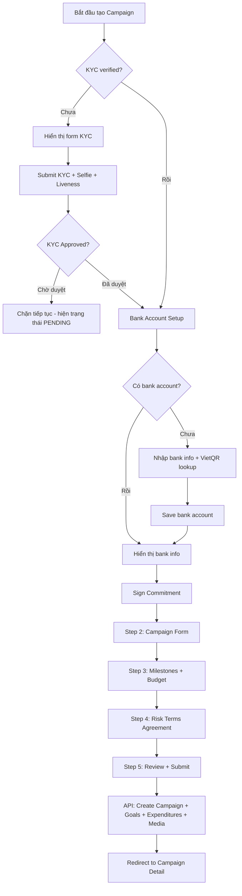
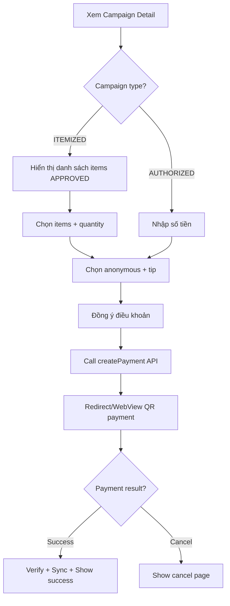

# Kế hoạch đồng bộ Flutter Mobile App theo Web App (danbox)

> **Ngày tạo:** 2026-05-04  
> **Tác giả:** Roo Architect  
> **Web app:** `../danbox/` (Next.js)  
> **Mobile app:** `../TrustFundMe-Mobile/` (Flutter)  
> **Backend:** `./` (TrustFundMe-BE - Spring Boot microservices)

---

## 1. Tổng quan kiến trúc hiện tại

### 1.1. Mobile App (Flutter)

| Thành phần | Chi tiết |
|---|---|
| **State Management** | Provider (ChangeNotifier) — chỉ có `AuthProvider` và `ChatProvider` |
| **HTTP Client** | Dio + FlutterSecureStorage cho JWT |
| **API Layer** | Một class duy nhất `ApiService` chứa tất cả API calls |
| **Models** | 10 models: user, campaign, chat, payment, feed_post, feed_comment, feed_post_revision, feed_post_media, expenditure_item, flag, forum_category, bank_account, appointment |
| **Screens** | 30+ screens |
| **Routing** | Dùng `Navigator.push` trực tiếp, không có named routes |
| **Auth** | JWT lưu trong FlutterSecureStorage, Google Sign-In |

### 1.2. Web App (Next.js - danbox)

| Thành phần | Chi tiết |
|---|---|
| **Framework** | Next.js App Router |
| **API Layer** | 26 service files riêng biệt, tổ chức theo domain |
| **State** | React Context (AuthContext), localStorage cho token |
| **Types** | TypeScript types cho campaign, expenditure, kyc, feedPost, notification, bankAccount, etc. |
| **Pages** | 50+ pages/routes bao gồm admin panel |
| **Auth** | JWT httpOnly cookies + localStorage, Google OAuth |

---

## 2. Bảng so sánh tính năng Web vs Mobile

### 2.1. Authentication & Profile

| Tính năng | Web | Mobile | Trạng thái |
|---|:---:|:---:|---|
| Login (email/password) | ✅ | ✅ | ✔ Đồng bộ |
| Register | ✅ | ✅ | ⚠ Web tách firstName/lastName, mobile dùng fullName |
| Google OAuth | ✅ | ✅ | ✔ Đồng bộ |
| Email verification (OTP) | ✅ | ✅ | ✔ Đồng bộ |
| Forgot/Reset password | ✅ | ✅ | ✔ Đồng bộ |
| Check email exists | ✅ | ❌ | 🔴 **Thiếu** |
| Session refresh (getSession) | ✅ | ❌ | 🔴 **Thiếu** - mobile chỉ lưu token, không verify lại |
| Profile update (fullName, phone) | ✅ | ✅ | ✔ Đồng bộ |
| Avatar upload | ✅ | ✅ | ⚠ Web dùng media proxy, mobile upload trực tiếp Supabase |
| Avatar crop modal | ✅ | ✅ | ✔ Cả hai đều có crop |
| KYC submission | ✅ | ❌ | 🔴 **Thiếu hoàn toàn** |
| KYC status check | ✅ | ❌ | 🔴 **Thiếu** |
| Face liveness check (biometric) | ✅ | ❌ | 🔴 **Thiếu** |
| Trust Score hiển thị | ✅ | ❌ | 🔴 **Thiếu** |
| Banned account detection | ✅ | ❌ | 🔴 **Thiếu** |
| `kycVerified` field trên UserModel | ✅ | ❌ | 🔴 Model thiếu field |
| `trustScore` field trên UserModel | ✅ | ❌ | 🔴 Model thiếu field |
| `cvUrl` field trên UserModel | ✅ | ❌ | 🔴 Model thiếu field |
| `createdAt` field trên UserModel | ✅ | ❌ | 🔴 Model thiếu field |

### 2.2. Tạo Campaign (New Campaign Flow)

| Tính năng | Web | Mobile | Trạng thái |
|---|:---:|:---:|---|
| **Step 1: Xác thực thông tin (Eligibility)** | ✅ | ❌ | 🔴 **Thiếu hoàn toàn** |
| - KYC check/submit | ✅ | ❌ | 🔴 |
| - Bank account setup (VietQR lookup) | ✅ | ⚠ | ⚠ Mobile có bank form nhưng không có VietQR |
| - Cam kết pháp lý (commitment) | ✅ | ❌ | 🔴 |
| **Step 2: Thông tin chiến dịch (Campaign Form)** | ✅ | ✅ | ⚠ Logic khác |
| - Title, description | ✅ | ✅ | ✔ |
| - Category selection | ✅ | ✅ | ✔ |
| - Multiple images + cover selection | ✅ | ✅ | ✔ |
| - AI generate description | ✅ | ✅ | ✔ |
| - Target amount auto-calc from milestones | ✅ | ❌ | 🔴 Mobile nhập thủ công |
| - Start/End date auto from milestones | ✅ | ❌ | 🔴 |
| - Location/Address | ✅ | ❌ | 🔴 |
| **Step 3: Giai đoạn (Milestones)** | ✅ | ❌ | 🔴 **Thiếu hoàn toàn** |
| - Tạo nhiều milestones | ✅ | ❌ | 🔴 |
| - Categories per milestone | ✅ | ❌ | 🔴 |
| - Items per category | ✅ | ❌ | 🔴 (mobile có flat items, không phân nhóm) |
| - Timeline: startDate, endDate, evidenceDueAt | ✅ | ❌ | 🔴 |
| **Step 4: Điều khoản (Terms)** | ✅ | ❌ | 🔴 **Thiếu** |
| - Risk terms agreement | ✅ | ❌ | 🔴 |
| - Full terms markdown render | ✅ | ❌ | 🔴 |
| **Step 5: Review & Submit** | ✅ | ⚠ | ⚠ Mobile có review đơn giản |
| - Preview panel real-time | ✅ | ❌ | 🔴 |
| - Stepper navigation (jump back/forward) | ✅ | ❌ | 🔴 Mobile chỉ có prev/next |

**Tóm tắt:** Web có luồng tạo campaign 5 bước đầy đủ với KYC + milestones + terms. Mobile chỉ có form đơn giản với các bước: chọn loại quỹ → nhập thông tin → thêm items → bank info → review.

### 2.3. Campaign Detail & Management

| Tính năng | Web | Mobile | Trạng thái |
|---|:---:|:---:|---|
| Xem chi tiết campaign | ✅ | ✅ | ✔ |
| Follow/Unfollow campaign | ✅ | ✅ | ✔ |
| Campaign progress (raised/goal) | ✅ | ✅ | ✔ |
| Recent donors | ✅ | ✅ | ✔ |
| Campaign posts (feed by campaign) | ✅ | ✅ | ✔ |
| Campaign analytics (chart) | ✅ | ❌ | 🔴 **Thiếu** |
| Campaign commitments | ✅ | ❌ | 🔴 **Thiếu** |
| Campaign transactions history | ✅ | ❌ | 🔴 **Thiếu** |
| Pause/Close campaign | ✅ | ❌ | 🔴 **Thiếu** |
| Edit campaign | ✅ | ✅ | ⚠ Mobile có edit đơn giản |
| Campaign statistics (fund owner) | ✅ | ❌ | 🔴 **Thiếu** |
| My campaigns (fund owner list) | ✅ | ✅ | ✔ |
| Campaign filter by status | ✅ | ❌ | 🔴 |
| Campaign filter by category | ✅ | ❌ | 🔴 |
| Follower count/list | ✅ | ❌ | 🔴 |

### 2.4. Donation Flow

| Tính năng | Web | Mobile | Trạng thái |
|---|:---:|:---:|---|
| Chọn items + quantity | ✅ | ✅ | ✔ |
| Amount-based donation | ✅ | ✅ | ✔ |
| Suggestion chips/presets | ✅ | ✅ | ✔ |
| Anonymous donation | ✅ | ✅ | ✔ |
| Tip selection | ✅ | ✅ | ✔ |
| Terms agreement modal | ✅ | ✅ | ✔ |
| Check item limit | ✅ | ✅ | ✔ |
| VietQR modal | ✅ | ❌ | 🔴 Mobile dùng WebView |
| Payment success page | ✅ | ✅ | ✔ |
| Payment cancel page | ✅ | ❌ | 🔴 |
| Verify donation | ✅ | ✅ | ✔ |
| My donations (impact) | ✅ | ✅ | ✔ |
| Sync quantity/balance | ✅ | ✅ | ✔ |
| Donation summary | ✅ | ✅ | ✔ |
| Donors by item | ✅ | ✅ | ✔ |

### 2.5. Feed/Posts (Community)

| Tính năng | Web | Mobile | Trạng thái |
|---|:---:|:---:|---|
| Feed list (paginated) | ✅ | ✅ | ✔ |
| Feed by campaign | ✅ | ✅ | ✔ |
| Feed by author | ✅ | ❌ | 🔴 |
| Create feed post | ✅ | ✅ | ✔ |
| Edit feed post | ✅ | ✅ | ✔ |
| Delete feed post | ✅ | ✅ | ✔ |
| Like/unlike post | ✅ | ✅ | ✔ |
| Comments (CRUD) | ✅ | ✅ | ✔ |
| Comment like | ✅ | ✅ | ✔ |
| My posts | ✅ | ✅ | ✔ |
| Post visibility toggle | ✅ | ✅ | ✔ |
| Post revisions history | ✅ | ✅ | ✔ |
| Upload images to post | ✅ | ✅ | ✔ |
| Forum categories filter | ✅ | ✅ | ✔ |
| Mark post seen (dwell tracking) | ✅ | ✅ | ✔ |
| Flag post/campaign | ✅ | ✅ | ✔ |
| My flags | ✅ | ✅ | ✔ |
| Post detail page | ✅ | ✅ | ✔ |

### 2.6. Expenditure Management

| Tính năng | Web | Mobile | Trạng thái |
|---|:---:|:---:|---|
| Xem danh sách expenditures | ✅ | ✅ | ✔ |
| Xem chi tiết expenditure | ✅ | ✅ | ✔ |
| Xem items | ✅ | ✅ | ✔ |
| Tạo expenditure | ✅ | ✅ | ✔ |
| Request withdrawal | ✅ | ✅ | ✔ |
| Update evidence status | ✅ | ✅ | ✔ |
| Update actuals | ✅ | ❌ | 🔴 **Thiếu** |
| Refund expenditure | ✅ | ❌ | 🔴 **Thiếu** |
| Import/Export Excel | ✅ | ❌ | 🔴 **Thiếu** (khó trên mobile) |
| AI audit (Perplexity) | ✅ | ❌ | 🔴 **Thiếu** |
| Categories per expenditure | ✅ | ❌ | 🔴 |
| Expenditure transactions | ✅ | ❌ | 🔴 |
| Pending evidence (per user) | ✅ | ❌ | 🔴 |
| Expenditure process flow UI | ✅ | ❌ | 🔴 |

### 2.7. Chat & Communication

| Tính năng | Web | Mobile | Trạng thái |
|---|:---:|:---:|---|
| Conversations list | ✅ | ✅ | ✔ |
| Chat messages | ✅ | ✅ | ✔ |
| Create conversation | ✅ | ✅ | ✔ |
| Get conversation by campaign | ✅ | ✅ | ✔ |
| WebSocket real-time | ✅ | ✅ | ✔ (STOMP) |
| Media upload in chat | ✅ | ❌ | 🔴 |
| Appointment scheduling | ✅ | ✅ | ✔ |

### 2.8. Notifications

| Tính năng | Web | Mobile | Trạng thái |
|---|:---:|:---:|---|
| Notification list | ✅ | ❌ | 🔴 **Thiếu hoàn toàn** |
| Unread count | ✅ | ❌ | 🔴 |
| Mark as read | ✅ | ❌ | 🔴 |
| Bell icon | ✅ | ❌ | 🔴 |
| Push notification (FCM) | ❌ | ❌ | ❌ Cả hai chưa có |

### 2.9. Account/Settings

| Tính năng | Web | Mobile | Trạng thái |
|---|:---:|:---:|---|
| Profile page | ✅ | ✅ | ✔ |
| Bank account management | ✅ | ✅ | ⚠ Web richer (check exists, webhook key) |
| Impact page (my donations) | ✅ | ✅ | ✔ |
| My flags page | ✅ | ✅ | ✔ |
| Commitments page | ✅ | ❌ | 🔴 |
| Schedule page | ✅ | ✅ | ✔ |
| Chat page in account | ✅ | ✅ | ✔ |
| Campaign expenditures management | ✅ | ✅ | ⚠ |
| Transactions page | ✅ | ❌ | 🔴 |

### 2.10. Web-Only Features (Admin/Staff)

Các tính năng sau chỉ dành cho admin/staff trên web, **không cần port sang mobile**:

- Admin Dashboard
- Admin Campaign Review/Approve/Reject
- Admin User Management (ban/unban, import/export)
- Admin KYC Review
- Admin Feed Post moderation (lock, status)
- Admin Flag review
- Admin Categories management
- Admin Modules management
- Admin Tasks management
- Admin Trust Score config
- Admin Cash Flow / General Fund
- Admin Payouts
- Admin Audit logs
- Staff Task assignment

---

## 3. API Endpoints Web gọi mà Mobile chưa gọi

| Service | Endpoint | Mô tả |
|---|---|---|
| **KYC** | `POST /api/kyc/users/:userId` | Submit KYC |
| **KYC** | `PUT /api/kyc/users/:userId` | Update KYC |
| **KYC** | `GET /api/kyc/me` | Get my KYC |
| **KYC** | `GET /api/kyc/user/:userId` | Get KYC by user |
| **Auth** | `POST /api/auth/check-email` | Check email exists |
| **Auth** | `GET /api/auth/me` | Verify session/get current user |
| **Campaign** | `GET /api/campaigns/status/:status` | Filter by status |
| **Campaign** | `GET /api/campaigns/category/:id` | Filter by category |
| **Campaign** | `PUT /api/campaigns/:id/review` | Review campaign |
| **Campaign** | `PUT /api/campaigns/:id/pause` | Pause campaign |
| **Campaign** | `PUT /api/campaigns/:id/close` | Close campaign |
| **Campaign** | `GET /api/campaigns/count/:userId` | Campaign count |
| **Campaign** | `GET /api/campaigns/statistics/:userId` | Statistics |
| **Campaign** | `POST /api/campaigns/commitments` | Sign commitment |
| **Campaign** | `GET /api/campaigns/commitments/:id` | Get commitment |
| **Campaign** | `GET /api/campaigns/commitments/check/:id` | Check commitment signed |
| **Campaign** | `POST /api/campaigns/commitments/send-email/:id` | Send commitment email |
| **Campaign** | `GET /api/campaigns/:id/transactions-history` | Transactions history |
| **Payment** | `GET /api/payments/campaign/:id/analytics` | Campaign analytics |
| **Payment** | `GET /api/payments/casso-transactions/:id` | Casso transactions |
| **Payment** | `GET /api/payments/user/:id/donation-count` | User donation count |
| **Expenditure** | `PUT /api/expenditures/:id/actuals` | Update actuals |
| **Expenditure** | `PUT /api/expenditures/:id/status` | Update status |
| **Expenditure** | `POST /api/expenditures/:id/refund` | Create refund |
| **Expenditure** | `POST /api/expenditures/:id/audit` | AI audit |
| **Expenditure** | `GET /api/expenditures/:id/categories` | Get categories |
| **Expenditure** | `POST /api/expenditures/:id/categories` | Create category |
| **Expenditure** | `GET /api/expenditures/transactions` | All transactions |
| **Expenditure** | `GET /api/expenditures/user/:id/pending-evidence` | Pending evidence |
| **Notification** | `GET /api/notifications/user/:id` | Get by user |
| **Notification** | `GET /api/notifications/user/:id/latest` | Get latest |
| **Notification** | `GET /api/notifications/user/:id/unread-count` | Unread count |
| **Notification** | `PUT /api/notifications/:id/read` | Mark as read |
| **Trust Score** | `GET /api/trust-score/user/:id` | Get user score |
| **Trust Score** | `GET /api/trust-score/leaderboard` | Leaderboard |
| **VietQR** | `GET https://api.vietqr.io/v2/banks` | Get bank list |
| **VietQR** | `POST https://api.vietqr.io/v2/lookup` | Account lookup |
| **BankAccount** | `GET /api/bank-accounts/check-exists` | Check account exists |
| **BankAccount** | `GET /api/bank-accounts/campaign/:id` | Get by campaign |
| **Fundraising Goal** | `PUT /api/fundraising-goals/:id` | Update goal |
| **Fundraising Goal** | `DELETE /api/fundraising-goals/:id` | Delete goal |
| **Media** | `GET /api/media/campaigns/:id` | Get all campaign media |
| **Media** | `GET /api/media/conversations/:id` | Get conversation media |
| **Media** | `GET /api/media/expenditures/:id` | Get expenditure media |
| **Media** | `GET /api/media/expenditure-items/:id` | Get item media |
| **Media** | `PATCH /api/media/:id/status` | Update media status |
| **Media** | `DELETE /api/media/:id/post` | Unlink from post |

---

## 4. Kế hoạch đồng bộ theo Module

### Module 1: KYC & Identity Enhancement ⭐ Ưu tiên CAO
**Lý do:** Bắt buộc để tạo campaign trên web flow mới

| Hạng mục | Chi tiết |
|---|---|
| **Thêm mới** | KYC submission screen (form nhập CCCD, upload ảnh, selfie) |
| **Thêm mới** | KYC status check (hiển thị trạng thái PENDING/APPROVED/REJECTED) |
| **Thêm mới** | Face liveness check (tích hợp camera + ML Kit hoặc tương đương) |
| **Cập nhật** | `UserModel` thêm fields: `kycVerified`, `trustScore`, `cvUrl`, `createdAt` |
| **Thêm mới** | `KycModel` với đầy đủ fields: idType, idNumber, issueDate, expiryDate, issuePlace, images, OCR fields, biometric |
| **Thêm mới** | `KycService` với submit, update, getMyKyc |
| **Thêm mới** | Trust score display trên profile |
| **Cập nhật** | `AuthProvider` hỗ trợ session verify (gọi `/auth/me`) |
| **Độ phức tạp** | **High** |

### Module 2: New Campaign Flow (5 bước) ⭐ Ưu tiên CAO
**Lý do:** Core feature, web đã có flow hoàn toàn mới

| Hạng mục | Chi tiết |
|---|---|
| **Viết lại** | `CreateCampaignScreen` → stepper 5 bước thay vì linear |
| **Step 1** | Eligibility: KYC check, bank account setup với VietQR integration, commitment signing |
| **Step 2** | Campaign form: giữ nguyên + thêm location, auto-calc từ milestones |
| **Step 3** | Milestones: tạo nhiều giai đoạn, mỗi giai đoạn có categories → items, timeline |
| **Step 4** | Terms: hiển thị full risk terms, require agreement |
| **Step 5** | Review: preview tổng quan tất cả thông tin, submit |
| **Thêm mới** | `MilestoneModel`, `MilestoneCategoryModel` |
| **Thêm mới** | `VietQRService` (gọi API vietqr.io) |
| **Thêm mới** | `CommitmentService` (sign, check, get) |
| **Cập nhật** | `ApiService` thêm endpoints cho milestones, commitments, VietQR |
| **Thêm mới** | Stepper widget (tương tự `NewCampaignTestStepper`) |
| **Thêm mới** | Real-time preview panel (optional, nice-to-have) |
| **Độ phức tạp** | **High** |

### Module 3: Notification System ⭐ Ưu tiên CAO
**Lý do:** UX thiết yếu cho user engagement

| Hạng mục | Chi tiết |
|---|---|
| **Thêm mới** | `NotificationModel` |
| **Thêm mới** | `NotificationService` / `NotificationProvider` |
| **Thêm mới** | Notification list screen |
| **Thêm mới** | Bell icon + unread badge trên AppBar |
| **Thêm mới** | Mark as read khi tap notification |
| **Tùy chọn** | FCM push notification integration |
| **Độ phức tạp** | **Medium** |

### Module 4: Campaign Detail Enhancement ⭐ Ưu tiên TRUNG BÌNH
**Lý do:** Nâng cấp trải nghiệm xem campaign

| Hạng mục | Chi tiết |
|---|---|
| **Thêm mới** | Campaign analytics tab (biểu đồ dùng fl_chart hoặc tương đương) |
| **Thêm mới** | Transactions history tab |
| **Thêm mới** | Follower count + list |
| **Thêm mới** | Campaign filter by status/category trên danh sách |
| **Thêm mới** | Pause/Close campaign actions (cho fund owner) |
| **Thêm mới** | Campaign statistics dashboard (cho fund owner) |
| **Thêm mới** | Commitment info display |
| **Cập nhật** | `CampaignModel` thêm fields: status, raisedAmount, goalAmount, fundOwnerName, startDate, endDate, location, followerCount |
| **Độ phức tạp** | **Medium** |

### Module 5: Expenditure Management Enhancement ⭐ Ưu tiên TRUNG BÌNH
**Lý do:** Fund owner cần quản lý chi tiêu đầy đủ

| Hạng mục | Chi tiết |
|---|---|
| **Thêm mới** | Update actuals (actual quantity, price, brand, link) |
| **Thêm mới** | Expenditure categories support |
| **Thêm mới** | Submit evidence screen |
| **Thêm mới** | Refund expenditure |
| **Thêm mới** | Expenditure process flow visualization |
| **Thêm mới** | Pending evidence list (per user) |
| **Cập nhật** | Expenditure detail screen thêm media gallery |
| **Độ phức tạp** | **Medium** |

### Module 6: Account/Settings Enhancement ⭐ Ưu tiên THẤP
**Lý do:** Bổ sung các trang phụ trợ

| Hạng mục | Chi tiết |
|---|---|
| **Thêm mới** | Commitments page |
| **Thêm mới** | Transactions page |
| **Cập nhật** | Bank account management: thêm VietQR lookup, check exists |
| **Thêm mới** | Banned account warning screen |
| **Cập nhật** | Profile page: hiển thị KYC status, trust score |
| **Độ phức tạp** | **Low** |

### Module 7: Cải thiện Architecture ⭐ Ưu tiên THẤP
**Lý do:** Technical debt, nâng cấp maintainability

| Hạng mục | Chi tiết |
|---|---|
| **Refactor** | Tách `ApiService` thành nhiều service theo domain (AuthService, CampaignService, PaymentService, FeedService...) giống web |
| **Refactor** | Thêm named/declarative routing (go_router) |
| **Refactor** | Thêm proper error handling layer |
| **Thêm mới** | Loading states & skeleton screens |
| **Thêm mới** | Offline support / caching |
| **Thêm mới** | Pagination helper (infinite scroll) |
| **Độ phức tạp** | **Medium** |

---

## 5. Luồng nghiệp vụ chính cần đồng bộ

### 5.1. Luồng tạo Campaign mới (Web flow)



### 5.2. Luồng Donation (cả web và mobile)



---

## 6. Thứ tự triển khai đề xuất

| Phase | Module | Mô tả | Độ phức tạp |
|---|---|---|---|
| **Phase 1** | Module 7 (partial) | Refactor ApiService thành domain services | Medium |
| **Phase 2** | Module 1 | KYC + Identity Enhancement | High |
| **Phase 3** | Module 2 | New Campaign Flow 5 bước | High |
| **Phase 4** | Module 3 | Notification System | Medium |
| **Phase 5** | Module 4 | Campaign Detail Enhancement | Medium |
| **Phase 6** | Module 5 | Expenditure Enhancement | Medium |
| **Phase 7** | Module 6 | Account/Settings | Low |
| **Phase 8** | Module 7 (remaining) | Architecture improvements | Medium |

---

## 7. Ghi chú kỹ thuật

### 7.1. Khác biệt kiến trúc cần lưu ý

1. **API Gateway**: Web gọi qua Next.js API routes (proxy) → BE. Mobile gọi trực tiếp từng service qua port riêng. Cần xem xét dùng API Gateway chung.

2. **Auth storage**: Web dùng httpOnly cookies + localStorage. Mobile dùng FlutterSecureStorage. Cần đảm bảo token refresh flow đồng nhất.

3. **Media upload**: Web dùng proxy route `/api/media/upload`. Mobile upload trực tiếp lên media-service port 8083. Nên thống nhất qua API Gateway.

4. **Avatar upload**: Web dùng media service proxy. Mobile upload trực tiếp Supabase Storage. Cần thống nhất.

### 7.2. Packages Flutter có thể cần thêm

| Package | Mục đích |
|---|---|
| `go_router` | Declarative routing |
| `fl_chart` | Biểu đồ analytics |
| `camera` | Face liveness check |
| `google_mlkit_face_detection` | Face detection cho liveness |
| `flutter_local_notifications` | Local notifications |
| `firebase_messaging` | Push notifications |
| `shimmer` | Skeleton loading |

### 7.3. Models cần tạo mới

- `KycModel` — theo `SubmitKycRequest` + `KycResponse` trên web
- `MilestoneModel` — giai đoạn chi tiêu
- `MilestoneCategoryModel` — danh mục trong giai đoạn
- `CommitmentModel` — cam kết pháp lý
- `NotificationModel` — thông báo
- `TrustScoreModel` — điểm uy tín
- `CampaignAnalyticsModel` — analytics data
- `ExpenditureTransactionModel` — giao dịch chi tiêu

### 7.4. UserModel fields cần bổ sung

```dart
// Fields hiện tại thiếu so với web:
bool kycVerified;      // KYC đã xác minh
double? trustScore;    // Điểm uy tín
String? cvUrl;         // URL CV
String? createdAt;     // Ngày tạo tài khoản
```
